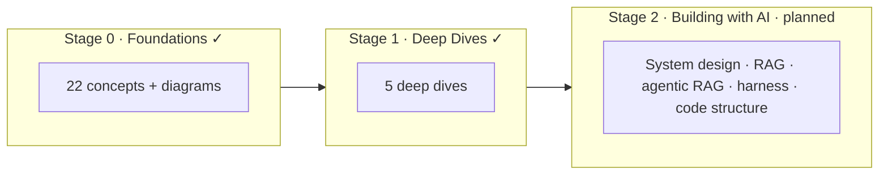

A personal knowledge vault for everything I'm learning about Artificial Intelligence —
notes, references, and mental models, organized as a learning path from foundations to
advanced topics.

The content is written mainly in **English**, with a **Vietnamese** translation available
from the language switcher in the top navigation for native-language readers.

## The learning path

The vault is organized as a staged path — from *understanding* AI, to *deepening* on the core
topics, to *building* real systems.

- **[Stage 0 — Foundations]()** ✓ — the core building blocks, for
  technical builders who *use* AI: models, prompting, context, embeddings, RAG, tools, agents,
  MCP, guardrails, security, evaluation, observability.
- **[Stage 1 — Deep Dives]()** ✓ — one level deeper on the topics
  that pay off in real systems: advanced RAG, agent patterns, prompt patterns, adaptation,
  evaluation in practice.
- **[Stage 2 — Building with AI]()** — *planned* — hands-on
  architecture with **C4 diagrams**: AI system design, building RAG, agentic RAG, the agent
  harness, and code structure.

New here? Start at **[Stage 0 — Foundations]()**.
