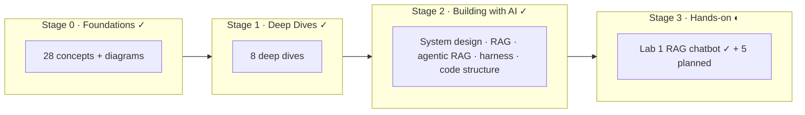

A personal knowledge vault for everything I'm learning about Artificial Intelligence —
notes, references, and mental models, organized as a learning path from foundations to
advanced topics.

The content is written mainly in **English**, with a **Vietnamese** translation available
from the language switcher in the top navigation for native-language readers.

## The learning path

The vault is organized as a staged path — from *understanding* AI, to *deepening* on the core
topics, to *building* real systems.

```mermaid
flowchart LR
    subgraph S0["Stage 0 · Foundations ✓"]
      A0[28 concepts + diagrams]
    end
    subgraph S1["Stage 1 · Deep Dives ✓"]
      A1[8 deep dives]
    end
    subgraph S2["Stage 2 · Building with AI ✓"]
      A2[System design · RAG · agentic RAG · harness · code structure]
    end
    subgraph S3["Stage 3 · Hands-on ◐"]
      A3[Lab 1 RAG chatbot ✓ + 5 planned]
    end
    S0 --> S1 --> S2 --> S3
```

- **[Stage 0 — Foundations]()** ✓ — the core building blocks, for
  technical builders who *use* AI: models, prompting, context, embeddings, RAG, tools, agents,
  MCP, guardrails, security, evaluation, observability.
- **[Stage 1 — Deep Dives]()** ✓ — one level deeper on the topics
  that pay off in real systems: prompt patterns, vector databases, types of RAG, advanced
  RAG, agent patterns, agent memory, adaptation, evaluation in practice.
- **[Stage 2 — Building with AI]()** ✓ — assembling the pieces into
  real systems: AI system design, building RAG, agentic RAG, the agent harness, code
  structure, and tooling & frameworks.
- **[Stage 3 — Hands-on]()** — *in progress* — real labs, starting
  with a RAG chatbot built in seven verifiable steps.

New here? Start at **[Stage 0 — Foundations]()**. The full
agenda — including the planned hands-on stages — lives on the
**[Roadmap]()**.
