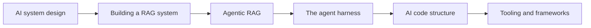

Where [Foundations]() explains the pieces and
[Deep Dives]() go deeper, **Stage 2** is about assembling them into
real systems — with diagrams for the architecture.

## Roadmap

## In this section

1. [AI system design]() — the standard shape of an AI app.
2. [Building a RAG system]() — end-to-end reference architecture.
3. [Agentic RAG]() — retrieval driven by an agent, not a fixed pipeline.
4. [The agent harness]() — the loop, context, tools, memory, guardrails.
5. [AI code structure]() — how to organize an AI app codebase.
6. [Tooling & frameworks]() — SDKs, frameworks, MCP, deployment.

## Prerequisites

Work through [Stage 0 — Foundations]() and
[Stage 1 — Deep Dives]() first — Stage 2 builds directly on both.
