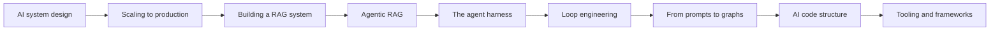

Where [Foundations]() explains the pieces and
[Deep Dives]() go deeper, **Stage 2** is about assembling them into
real systems — with diagrams for the architecture.

## Roadmap

```mermaid
flowchart LR
    A[AI system design] --> S[Scaling to production] --> B[Building a RAG system] --> C[Agentic RAG]
    C --> D[The agent harness] --> E[Loop engineering] --> F[From prompts to graphs] --> G[AI code structure] --> H[Tooling and frameworks]
```

## In this section

1. [AI system design]() — the standard shape of an AI app.
2. [Scaling to production]() — gateway, caching, serving, queues, reliability, cost at scale.
3. [Building a RAG system]() — end-to-end reference architecture.
4. [Agentic RAG]() — retrieval driven by an agent, not a fixed pipeline.
5. [The agent harness]() — the loop, context, tools, memory, guardrails.
6. [Loop engineering]() — designing the loops themselves: closed loops, validators, orchestration.
7. [From prompts to graphs]() — the five engineering disciplines as one evolution.
8. [AI code structure]() — how to organize an AI app codebase.
9. [Tooling & frameworks]() — SDKs, frameworks, MCP, deployment.

## Prerequisites

Work through [Stage 0 — Foundations]() and
[Stage 1 — Deep Dives]() first — Stage 2 builds directly on both.
