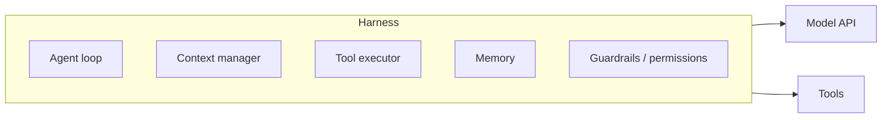
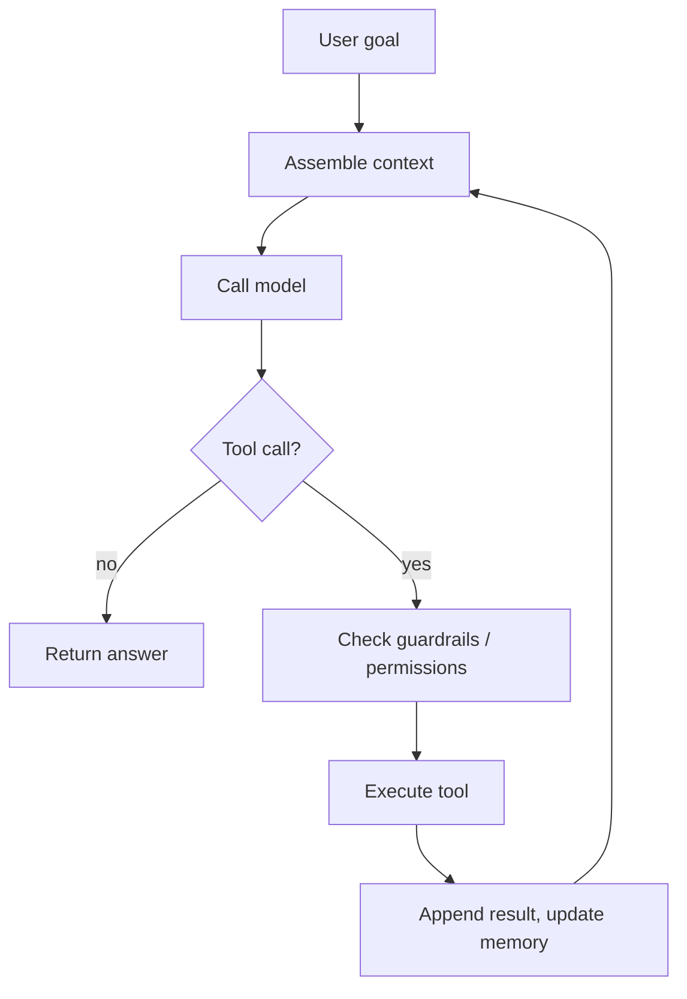

Builds on [Agentic AI](). The model is the engine; the
**harness** is everything around it that turns a single model call into a working agent. This
page is how one is built.

## What the harness owns

## The loop

At its core the harness runs one loop until the task is done:

Each turn: assemble the context, call the [model](), and
if it returns a [tool call](), execute it,
append the result, and loop — until the model answers or a stop condition fires.

## The hard parts

- **Context management** — the [window]() is
  finite; as the loop grows you must summarize or trim old tool results, or the run breaks.
- **Tool execution** — validate arguments, gate risky actions behind approval, run parallel
  calls, and return errors as results the model can recover from.
- **Memory** — carry facts across turns (and sessions) without stuffing everything into the
  window.
- **Stop conditions** — max steps, loop detection, and a token/time budget, so a stuck agent
  ends gracefully instead of spinning.
- **Guardrails** — apply [input/output checks]() and
  [security]() on *every* turn, not just the first.

## Build vs. buy

You rarely hand-write all of this:

- **Write your own loop** — full control; the most work.
- **Use a framework / SDK** — the loop, tool handling, and context management come built in.
- **Managed service** — a provider hosts the loop and the tool sandbox for you.

Choosing among these is the [Tooling & frameworks]() topic, coming next.
