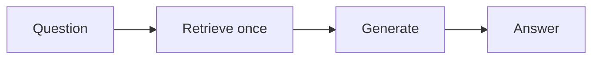
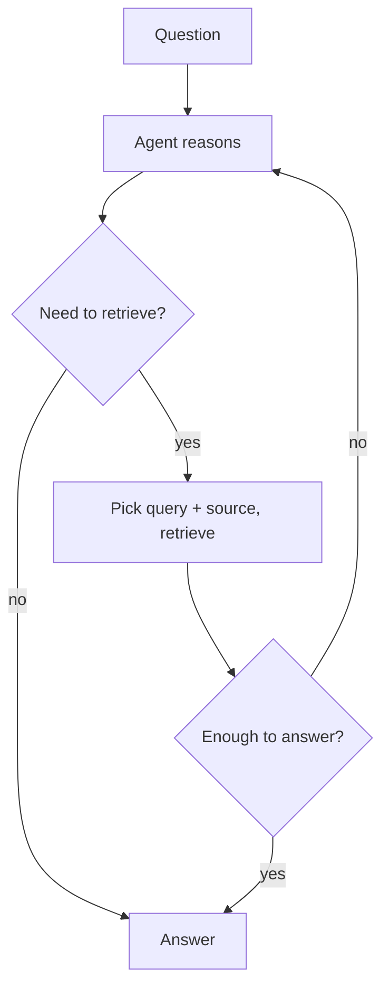

Builds on [Agentic AI]() and
[Types of RAG](). In **standard RAG** the pipeline is
fixed — always retrieve once, then generate. **Agentic RAG** hands that control to an
[agent](): it decides *whether*, *what*, and *how often* to
retrieve, using retrieval as a tool.

## Standard vs. agentic

Standard RAG, above, is one fixed pass. Agentic RAG, below, is a loop the agent controls:

## What the agent decides

- **Whether** to retrieve at all — some questions don't need it.
- **What** query to use — often a rewrite of the user's question, or several sub-queries.
- **Which source** — different vector stores, a web search, a database, an API.
- **How many rounds** — retrieve, read, then retrieve again for a follow-up fact (multi-hop).
- **Whether the context is enough** — re-retrieve or ask for clarification if not.

Retrieval becomes a [tool]() the agent calls,
not a fixed first step.

## When to use it

- ✅ **Multi-hop questions** — the answer needs a fact that requires a second lookup.
- ✅ **Multiple sources** — the agent routes to the right one.
- ✅ **Ambiguous queries** — the agent can rewrite, or ask, before retrieving.
- ❌ **Simple Q&A over one corpus** — [standard RAG]() is
  faster, cheaper, and more predictable.

## The trade-off

More capable, but more latency, cost, and moving parts — and harder to make reliable (the agent
can loop or retrieve poorly). Add [guardrails](), step
limits, and [evaluation]() — especially the
retrieval-quality checks in [Advanced RAG](). Reach for
agentic RAG only when standard or advanced RAG genuinely falls short.
