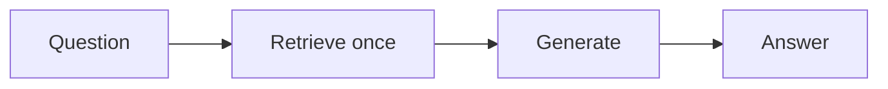
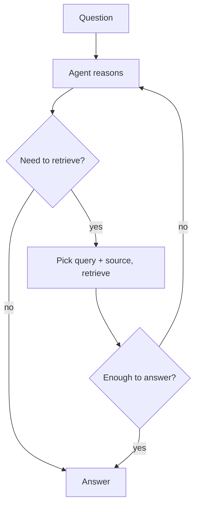

Builds on [Agentic AI]() and
[Types of RAG](). In **standard RAG** the pipeline is
fixed — always retrieve once, then generate. **Agentic RAG** hands that control to an
[agent](): it decides *whether*, *what*, and *how often* to
retrieve, using retrieval as a tool.

## Standard vs. agentic

```mermaid
flowchart LR
    Q1[Question] --> R1[Retrieve once] --> G1[Generate] --> A1[Answer]
```

Standard RAG, above, is one fixed pass. Agentic RAG, below, is a loop the agent controls:

```mermaid
flowchart TD
    Q[Question] --> A[Agent reasons]
    A --> D{Need to retrieve?}
    D -->|no| Ans[Answer]
    D -->|yes| R[Pick query + source, retrieve]
    R --> C{Enough to answer?}
    C -->|no| A
    C -->|yes| Ans
```

## What the agent decides

- **Whether** to retrieve at all — some questions don't need it.
- **What** query to use — often a rewrite of the user's question, or several sub-queries.
- **Which source** — different vector stores, a web search, a database, an API.
- **How many rounds** — retrieve, read, then retrieve again for a follow-up fact (multi-hop).
- **Whether the context is enough** — re-retrieve or ask for clarification if not.

Retrieval becomes a [tool]() the agent calls,
not a fixed first step.

A multi-hop question shows the difference: *"Does our retention policy allow deleting the
audit logs of a churned customer?"* Standard RAG retrieves once — probably the retention
policy — and answers with half the picture. An agentic loop retrieves the retention policy,
notices audit logs are governed separately, retrieves the audit-log policy, then checks the
churn-specific clause: three lookups, each shaped by what the last one said.

## When to use it

- ✅ **Multi-hop questions** — the answer needs a fact that requires a second lookup.
- ✅ **Multiple sources** — the agent routes to the right one.
- ✅ **Ambiguous queries** — the agent can rewrite, or ask, before retrieving.
- ❌ **Simple Q&A over one corpus** — [standard RAG]() is
  faster, cheaper, and more predictable.

## The trade-off

More capable, but more latency, cost, and moving parts — and harder to make reliable (the agent
can loop or retrieve poorly). Add [guardrails](), step
limits, and [evaluation]() — especially the
retrieval-quality checks in [Advanced RAG](). Reach for
agentic RAG only when standard or advanced RAG genuinely falls short.

## Sources

- Asai et al., *Self-RAG* (2023) — [arXiv:2310.11511](https://arxiv.org/abs/2310.11511)
- Yan et al., *Corrective RAG (CRAG)* (2024) — [arXiv:2401.15884](https://arxiv.org/abs/2401.15884)
