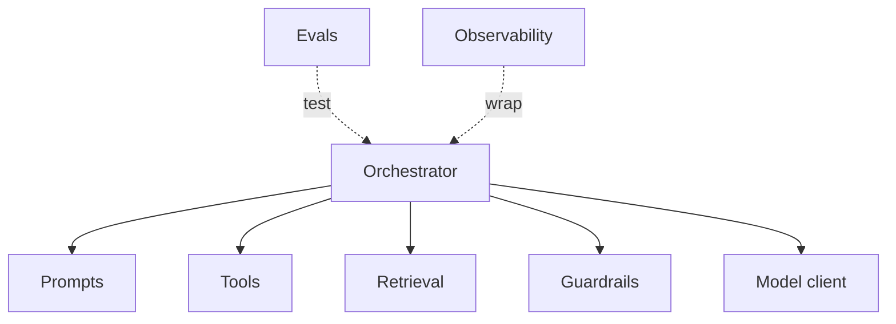

An AI app has more moving parts than a normal service — prompts, tools, retrieval, guardrails,
evals. Cramming them into one file makes them impossible to test or change. A little structure
keeps each concern separate and swappable.

## A suggested layout

```text
app/
├── prompts/          # versioned prompt templates (not inline strings)
├── tools/            # tool definitions + handlers, one per tool
├── retrieval/        # ingestion + query: chunk, embed, vector store
├── orchestrator/     # the harness: assemble context, run the loop
├── guardrails/       # input/output checks, PII redaction
├── evals/            # eval sets + runners (run in CI)
├── observability/    # tracing, logging, metrics
├── clients/          # model API client(s)
└── config/           # settings, model ids — no secrets in code
```

## How the pieces depend



## Principles

- **Prompts are files, not string literals** — version them, diff them, test them (see
  [Prompt engineering]()).
- **One tool = one module** — a definition + a handler you can test in isolation (see
  [Tool & function calling]()).
- **Keep retrieval separate** — the [ingest and query pipelines]()
  are their own layer, not tangled into the orchestrator.
- **A thin orchestrator** — the [harness]() just wires
  the pieces together; keep logic in the pieces.
- **Evals are first-class** — an [eval set]()
  is your test suite; run it in CI on every prompt or model change.
- **Config and secrets out of code** — model ids and settings in config; secrets in the
  environment, never in prompts or the repo.

## Why it pays off

When retrieval quality drops, you swap models, or a prompt regresses, you change *one* place —
and your evals tell you whether it worked, instead of hunting through a monolith.
