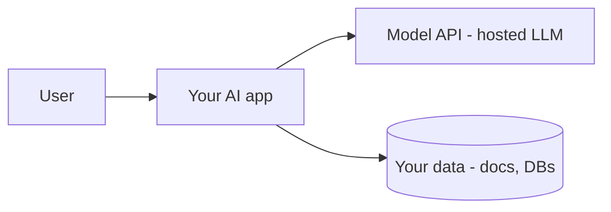
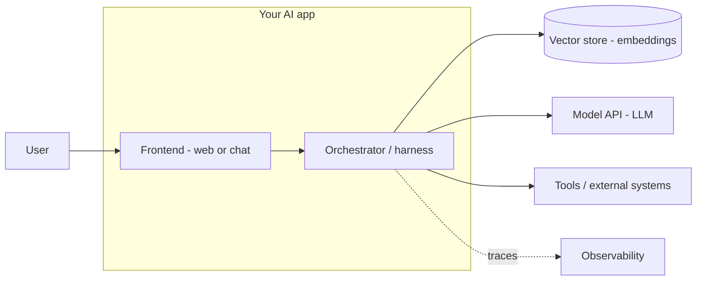

Building an AI feature is mostly *systems* work — the model is one component among several.
This page gives you the standard shape to build around.

## The big picture

A user talks to your app; your app talks to a hosted model and to your data. You own
everything except the model itself.

## The standard components

The **orchestrator (harness)** is the brain you build: it assembles the prompt, manages the
[context window](), runs the
[agent loop](), calls
[tools](), and applies
[guardrails]().

## Where each foundation concept lives

| Concept | Lives in |
| --------- | ---------- |
| Prompting, context | Orchestrator |
| Embeddings, RAG | Vector store + retrieval |
| Tools, agents | Orchestrator loop + tools |
| Guardrails, security | Around inputs and outputs |
| Evaluation, observability | Cross-cutting, around everything |

## Design principles

- The model is **stateless** — you own state and context.
- Put **determinism in code**, judgment in the model.
- **Ground** with data, **constrain** with schemas, **gate** risky actions.
- **Measure** everything — evals offline, traces online.
