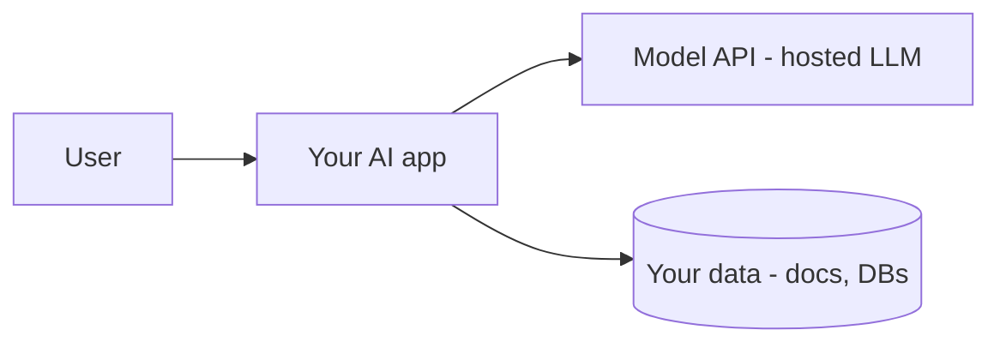
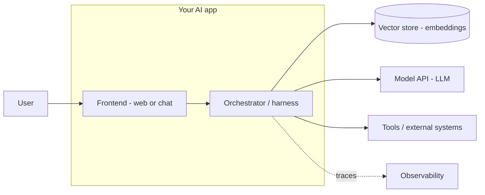

Building an AI feature is mostly *systems* work — the model is one component among several.
This page gives you the standard shape to build around.

## The big picture

```mermaid
flowchart LR
    U[User] --> App[Your AI app]
    App --> Model[Model API - hosted LLM]
    App --> Data[(Your data - docs, DBs)]
```

A user talks to your app; your app talks to a hosted model and to your data. You own
everything except the model itself.

## The standard components

```mermaid
flowchart LR
    U[User] --> UI[Frontend - web or chat]
    subgraph App[Your AI app]
      UI --> Orch[Orchestrator / harness]
    end
    Orch --> Vec[(Vector store - embeddings)]
    Orch --> Model[Model API - LLM]
    Orch --> Tools[Tools / external systems]
    Orch -. traces .-> Obs[Observability]
```

The **orchestrator (harness)** is the brain you build: it assembles the prompt, manages the
[context window](), runs the
[agent loop](), calls
[tools](), and applies
[guardrails]().

## Where each foundation concept lives

| Concept | Lives in |
| --------- | ---------- |
| Prompting, context | Orchestrator |
| Embeddings, RAG | Vector store + retrieval |
| Tools, agents | Orchestrator loop + tools |
| Guardrails, security | Around inputs and outputs |
| Evaluation, observability | Cross-cutting, around everything |

## Design principles

- The model is **stateless** — you own state and context.
- Put **determinism in code**, judgment in the model.
- **Ground** with data, **constrain** with schemas, **gate** risky actions.
- **Measure** everything — evals offline, traces online.
- **Version your prompts** — prompts are code: keep them in the repo, review changes, and
  record which version produced which output (it's how you debug "it worked yesterday").
- **The right stack, not the biggest** — RAG, agents, memory, and MCP each earn their place
  only when the problem demands them; the strongest systems use the fewest components that
  solve the task, because every extra one is latency, cost, and attack surface.

This page is the *shape* of an AI app. Making that shape survive real traffic — gateways,
caching, serving, queues, reliability, and cost at scale — is
[Scaling to production]().

## Sources

- [Anthropic — Building effective agents](https://www.anthropic.com/research/building-effective-agents)
- [Anthropic — Effective context engineering for AI agents](https://www.anthropic.com/engineering/effective-context-engineering-for-ai-agents)
