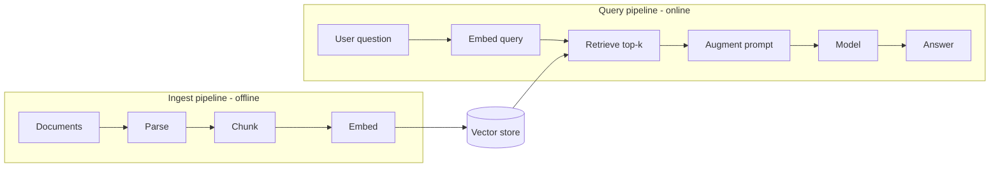

Builds on [RAG in Foundations](). A real RAG system is **two
pipelines** that meet at the vector store: one runs *offline* to index your data, the other
runs *online* per question.

## The two pipelines

## Ingest pipeline (offline)

Runs when data changes, not per request:

1. **Parse** documents (PDF, HTML, Word) into clean text.
2. **Chunk** into passages sized for retrieval.
3. **Embed** each chunk with an [embedding model]().
4. **Store** the vectors (+ source metadata) in the vector store.

Re-run it when documents change — no model retraining needed.

## Query pipeline (online)

Runs per user question:

1. **Embed** the question with the *same* embedding model.
2. **Retrieve** the top-k most similar chunks from the vector store.
3. **Augment** the prompt with those chunks as context.
4. **Generate** the answer — ideally with citations back to the sources.

## The components you build

| Component | Job |
| ----------- | ----- |
| Ingestion job | Parse → chunk → embed → store (scheduled or on change) |
| Embedding model | Same model for documents and queries |
| Vector store | Index + similarity search (pgvector, FAISS, …) |
| Retriever | Fetch top-k (add hybrid + re-ranking as needed) |
| Orchestrator | Build the augmented prompt, call the model, format citations |

## Getting it right

Most RAG quality problems are **retrieval** problems, not model problems — chunking, hybrid
search, and re-ranking are the levers. See
[Advanced RAG]() for those, and evaluate retrieval and
generation separately (see [Evaluation in practice]()).
