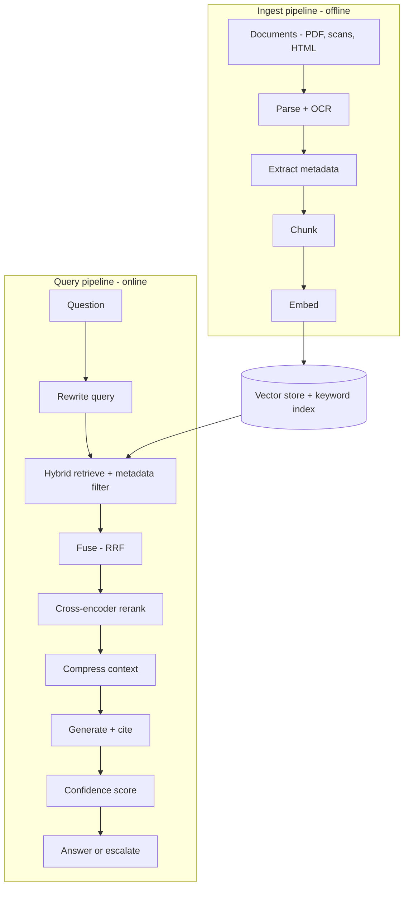

Builds on [RAG in Foundations](). A production RAG system is **much more
than** *Documents → Embeddings → LLM*. It's **two pipelines** that meet at the store — an
*offline* ingest pipeline and an *online* query pipeline — with a chain of stages in each. The
thesis to keep in mind:

> Answer quality depends far more on **retrieval** than on the LLM. The model is the reasoning
> engine; retrieval is where the engineering happens.

```mermaid
flowchart TB
    subgraph Ingest[Ingest pipeline - offline]
      D[Documents - PDF, scans, HTML] --> P[Parse + OCR] --> M[Extract metadata]
      M --> C[Chunk] --> E1[Embed]
    end
    E1 --> V[(Vector store + keyword index)]
    subgraph Query[Query pipeline - online]
      Q[Question] --> QR[Rewrite query] --> R[Hybrid retrieve + metadata filter]
      R --> F[Fuse - RRF] --> RR[Cross-encoder rerank] --> CC[Compress context]
      CC --> G[Generate + cite] --> CF[Confidence score] --> A[Answer or escalate]
    end
    V --> R
```

## Ingest pipeline (offline)

Runs when data changes, not per request — no model retraining needed.

- **Parse + OCR** — turn messy real documents into clean text. *Why:* if parsing is wrong,
  everything downstream is garbage. *Example:* a scanned invoice PDF → OCR extracts the text
  and a layout-aware parser keeps the table intact, so `Total: $4,012` isn't split from its
  label. Handle PDFs, Word, HTML, images, tables, and code blocks distinctly.
- **Extract metadata** — attach `{source, page, section, date, …}` to each chunk. *Why:* it
  powers [filtering]() and citations — without it
  you can't scope "only 2026 Pro-plan docs" or cite a source. *Example:*
  `{source: handbook.pdf, page: 12, section: "Refunds", date: 2026}`.
- **Chunk** — split into retrievable passages. *Why:* chunk size is a top-3 quality lever.
  *Example:* recursive chunking that splits on headings then paragraphs, with ~15% overlap so
  a thought isn't cut mid-sentence. See [chunking strategies]().
- **Embed** — vectorize each chunk with an [embedding model]().
  Use the **same model** for documents and queries.
- **Store** — index vectors (+ metadata) in a [vector store]()
  and build a keyword index alongside for hybrid search.

## Query pipeline (online)

Runs per question — this chain is where most quality is won or lost.

- **Rewrite query** — the user's words are often not the best search query. *Why:* better
  query → better recall. *Example:* *"how long to send it back?"* → rewritten to *"return /
  refund window policy"*; or expanded into several rephrasings. See
  [query transformation]().
- **Hybrid retrieve + filter** — run **vector** (meaning) and **BM25** (exact terms) together,
  scoped by metadata. *Why:* each covers the other's blind spot. *Example:* *"error E-4012"* —
  vector finds the paraphrased troubleshooting doc, BM25 finds the exact code; the metadata
  filter limits it to the current product version.
- **Fuse (RRF)** — merge the two ranked lists with Reciprocal Rank Fusion into one ordering.
  *Why:* combines dense and sparse fairly without hand-tuned weights.
- **Cross-encoder rerank** — re-score the top ~50 with a model that reads query and passage
  *together*, keep the top few. *Why:* far more accurate than embedding similarity, so the
  best passage ranks first. *Example:* a passage that merely mentions the keywords drops below
  the one that actually answers the question.
- **Compress context** — trim each surviving chunk to just the relevant sentences. *Why:*
  cuts tokens and raises faithfulness by removing distraction. *Example:* a 1,200-token chunk →
  the 2 sentences that state the refund window. See
  [context compression]().
- **Generate + cite** — build the augmented prompt, call the model, and cite the chunk each
  claim came from. *Why:* citations make answers verifiable and are the antidote to
  hallucination. *Example:* *"Refunds are within 30 days [handbook.pdf p.12]."*
- **Confidence score + escalate** — judge how well-grounded the answer is. *Why:* you need to
  know when to *abstain* instead of guessing. *Example:* low retrieval scores or an answer no
  chunk supports → return *"not confident — escalating to a human"* rather than a fluent
  hallucination. Ties into [guardrails]() and
  [responsible AI]().

## The components you build

| Component | Job |
| ----------- | ----- |
| Ingestion job | Parse/OCR → extract metadata → chunk → embed → store (scheduled or on change) |
| Embedding model | Same model for documents and queries |
| Vector + keyword store | Similarity search + BM25 ([pgvector]()) |
| Retriever | Query rewrite → hybrid retrieve → filter → RRF → rerank → compress |
| Orchestrator | Build the prompt, call the model, format citations, score confidence |

## Getting it right

Most RAG quality problems are **retrieval** problems, not model problems. Add stages in order
of payoff — hybrid search and re-ranking first, then compression and confidence — and
**evaluate retrieval and generation separately** (see
[Evaluation in practice]()). Don't build
the whole chain on day one; add each stage when a real failure demands it. At scale, this
pipeline also needs caching, queues, and reliability — see
[Scaling to production]().

## Sources

- Lewis et al., *Retrieval-Augmented Generation for Knowledge-Intensive NLP Tasks* (2020) — [arXiv:2005.11401](https://arxiv.org/abs/2005.11401)
- Es et al., *RAGAS: Automated Evaluation of Retrieval Augmented Generation* (2023) — [arXiv:2309.15217](https://arxiv.org/abs/2309.15217)
- [Google Cloud — Document AI (OCR & parsing)](https://cloud.google.com/document-ai/docs/overview)
- Jiang et al., *LLMLingua: Compressing Prompts for Accelerated Inference* (2023) — [arXiv:2310.06839](https://arxiv.org/abs/2310.06839)
