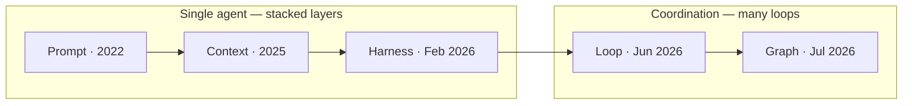
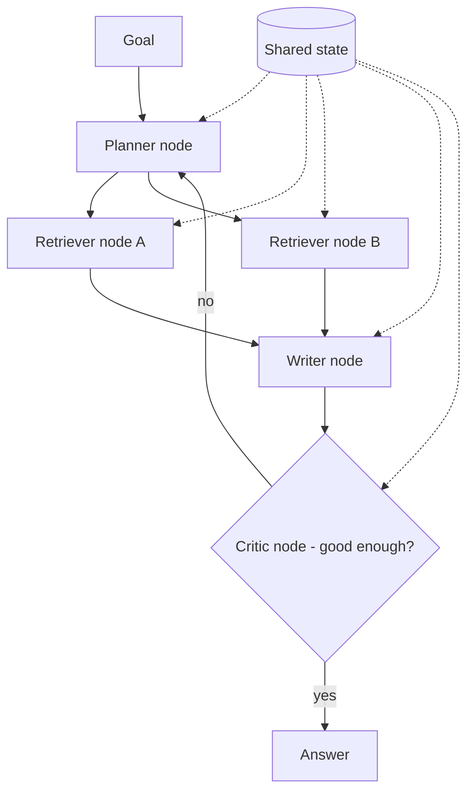

## Goal

Make sense of the vocabulary explosion: **prompt → context → harness → loop → graph
engineering**, five terms in about five years. This page places them on one timeline, gives
one worked example per era, and shows the structural line that separates them — so the next
new "-engineering" term lands in a mental model instead of adding to the confusion.

## The one distinction that organizes all five

Each discipline exists because the previous one hit a wall. But they split cleanly into two
groups:

- **Prompt, context, harness** are three **layers of the same single-agent problem** — how one
  model gets the right instruction, the right knowledge, and the right guardrails.
- **Loop and graph** are about **coordination** — how work repeats and how multiple agents
  divide it. A graph is just what a loop becomes when one loop isn't enough.

That's the whole map. The rest of this page is what each layer adds.

## What each era added

Read this as a ladder — every rung solves a failure the rung below couldn't:

| Era | Discipline | What it adds | The failure it fixes |
| ------ | ------ | ------ | ------ |
| 2022 | [Prompt]() | Shaping one exchange | — |
| 2025 | [Context]() | Everything the model knows beyond the prompt | A perfect prompt still can't add knowledge the model lacks |
| Feb 2026 | [Harness]() | Constraints and gates around the agent | A good prompt won't stop an agent from `rm -rf`-ing your repo |
| Jun 2026 | [Loop]() | The plan–execute–verify cycle and what counts as done | One call can't check and fix its own work |
| Jul 2026 | Graph | Many loops wired via nodes, edges, shared state | One sequential loop stalls on work that needs parallel, specialized roles |

### Prompt engineering — shaping one exchange

*"Summarize this contract in five bullet points; use only the text provided."* You are tuning
the single instruction. This is the whole game when the model already knows what it needs and
the task is one turn.

**Wall:** the model can't answer about *your* documents — no prompt contains knowledge the
model was never given.

### Context engineering — managing what the model knows

You assemble everything around the prompt: retrieved documents ([RAG]()),
[memory](), tool definitions, session history — and,
just as important, what to leave out so the [context window]()
stays lean. Example: a support bot answers about *this* customer's plan because context
engineering put the account record and the relevant policy in the window.

**Wall:** now the agent can *act* (edit files, call APIs) — and nothing stops it from acting
wrongly at scale.

### Harness engineering — constraints and gates

The [harness]() is the scaffolding that keeps an agent
in bounds: permissions, sandboxes, approval gates, tool allow-lists. Example: a coding agent
may edit files freely but a gate blocks shell deletes and requires human approval before it
merges. A good prompt is a *request*; a harness is an *architectural* stop — the agent can't
cross the line even if it decides to.

**Wall:** a single pass is rarely right; quality needs iterate-and-check.

### Loop engineering — the repeat cycle

Design the [plan–execute–verify loop](): what
triggers each step, who validates the result, what counts as done, and what stops it.
Example: the SonarQube autofixer — a fixer patches, a reviewer judges, feedback loops back,
bounded by a hard limit.

**Wall:** one loop, running sequentially, chokes when a job needs different specialists or
parallel work.

### Graph engineering — wiring many loops together

When one loop isn't enough, you model the work as a **graph**: **nodes** (agents or steps),
**edges** (what flows to what, including conditional branches), and **shared state** (what
every node can read and write). A supervisor no longer does the work — it routes.

Example: a research assistant where a planner splits the question, two retriever nodes run in
**parallel** against different sources, a writer merges, and a critic node loops back on a
conditional edge until the answer passes. Each node is its own small loop; the graph is the
wiring.

This is where [multi-agent systems]() and the
"orchestration" rung of [loop engineering]() meet:
graph engineering is the *structure* that orchestration runs on. Notably, the idea isn't new
— frameworks like LangGraph modeled nodes/edges/state before the term "graph engineering"
existed, which is the tell that some of this is **new vocabulary for existing architecture**.

Don't confuse this **execution graph** (nodes = agents/steps, edges = control flow) with a
**knowledge graph** (nodes = entities, edges = relations) used as shared agent memory — same
word, different graphs; see [Multi-agent systems]().

## Layers vs. renamed eras — a caution

Two of these transitions are real new architecture; some are mostly naming. Harness → loop →
graph appeared in about five months — a pace that says as much about marketing as about
engineering. The useful reading:

- **Genuinely distinct:** prompt, context, and harness *stack* — a real system does all three
  at once, they're not alternatives.
- **Closely related:** loop and graph are the same coordination idea at different scales — one
  cycle vs. many wired together.

So when the next "-engineering" term arrives, ask: *is this a new layer of the single-agent
problem, a new scale of coordination, or a new word for something the frameworks already do?*
That question is the durable takeaway; the labels will keep changing.

## How they stack in one real system

They aren't a menu — a production agent uses all of them at once:

| Layer | In a coding agent |
| ------ | ------ |
| Prompt | The task you type |
| Context | The files, history, and docs it's given |
| Harness | Its permissions, sandbox, approval gates |
| Loop | Edit → run tests → fix, until green |
| Graph | A planner delegating to coder + reviewer + tester sub-agents |

## Sources

- Osmani, *Loop Engineering* (2026) — [addyo.substack.com](https://addyo.substack.com/p/loop-engineering)
- [Anthropic — Effective context engineering for AI agents](https://www.anthropic.com/engineering/effective-context-engineering-for-ai-agents)
- [Anthropic — Effective harnesses for long-running agents](https://www.anthropic.com/engineering/effective-harnesses-for-long-running-agents)
- [LangGraph — Low-level concepts (nodes, edges, state)](https://langchain-ai.github.io/langgraph/concepts/low_level/)
- Hong et al., *MetaGPT: Meta Programming for Multi-Agent Collaborative Framework* (2023) — [arXiv:2308.00352](https://arxiv.org/abs/2308.00352)
