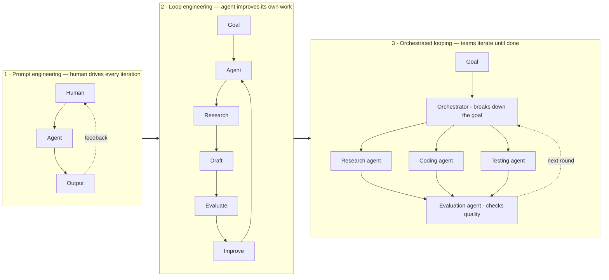
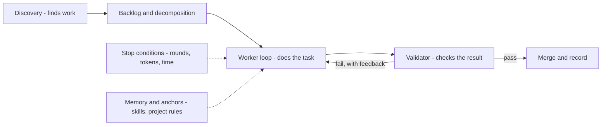
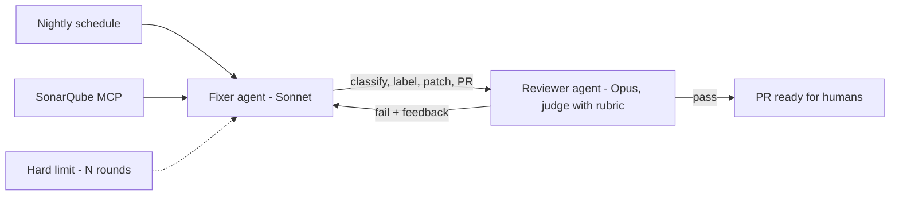

## Goal

Answer the questions a builder actually asks about loops: what *is* loop engineering, what
are its parts, how many kinds are there, why is it needed — and do you have to code one on an
SDK, or can [Claude Code / Codex]() do it?

## What it is

**Loop engineering is designing the iteration itself, instead of doing the iterating.**
[Prompt engineering]() shapes *one model
call*; the [harness]() runs *one agent's loop*; loop
engineering designs the **system of loops**: what repeats, who checks the result, what counts
as "done", and what stops it. In one line: you stop being the person who prompts the agent —
you build the thing that prompts the agent.

## The maturity ladder

How the field got here — each generation fixed the last one's failure:

| Year | Loop | Lesson it taught |
| ------ | ------ | ------ |
| 2022 | **ReAct** — reason → act → observe, one model, one loop | Iteration beats one-shot answers |
| 2023 | **AutoGPT** — goal-seeking loop | Famous for spinning forever → loops need **stop conditions** |
| 2025 | **Ralph loop** — the same prompt re-run against fixed anchor files | Persistent anchors keep long runs coherent |
| Early 2026 | **Productised loops** — a validator decides when work is done | "Done" must be *checked*, not self-declared |
| Mid 2026 | **Orchestration** — a supervisor schedules and coordinates worker loops | One loop doesn't scale; teams of loops do |

## Anatomy — the parts

A production loop has six parts. The worker is the *least* interesting one:

- **Discovery / automations** — finds work without a human trigger: a schedule, a webhook, a
  scanner.
- **Decomposition** — an orchestrator breaks the goal into tasks workers can own.
- **Worker** — an agent with [tools]() and
  [MCP connectors](); parallel workers get **git worktrees**
  so they don't overwrite each other.
- **Validator** — a second judgment ([LLM-as-judge](),
  a test suite, or both) that decides pass/fail — never the worker grading itself.
- **Stop conditions** — max rounds, token budget, loop detection: the AutoGPT lesson,
  inherited from the [harness]().
- **Memory & anchors** — [skills](), project rules,
  and [agent memory]() so each round builds on the
  last instead of rediscovering it.

## The types — three axes

Any loop you meet is a point on three independent axes:

| Axis | Options | The trade |
| ------ | ------ | ------ |
| **Architecture** | **Open loop** — agent free to explore, decide next steps · **Closed loop** — predefined goal, criteria, and thresholds | Open suits unknown problems but burns tokens and resists prediction; closed is cheaper, repeatable, improvable — production defaults to closed |
| **Oversight** | **Human in the loop** — approves each step · **on the loop** — monitors, intervenes on exception · **out of the loop** — reviews outcomes only | The same ladder as [responsible-ai's placements](), applied to loops: you graduate from sitting inside one loop to designing loops that watch other loops |
| **Topology** | **Single loop** — one worker · **Orchestrated** — supervisor + specialized workers | Single is simpler and usually enough; orchestrate when tasks parallelize or need separate maker and checker roles |

## Why you need it

- **One-shot calls cap out** — quality comes from iterate-and-verify, and doing that manually
  makes *you* the bottleneck (the human-in-the-loop panel of the diagram).
- **Trust requires a validator** — unreviewed agent output doesn't ship; a loop with a
  checker turns "plausible" into "verified".
- **Cost control requires closure** — open exploration is unpredictable spend; closed loops
  with thresholds make cost and quality *measurable per run*, so each run can be improved.

## SDK, or Claude Code / Codex off the shelf?

The honest answer: **start with the tools — you already own a production-grade loop.**
Claude Code and Codex *are* loop products: harness, tools, skills, MCP, stop conditions all
built in. There's a ladder, and each rung must be earned:

1. **Use the tool interactively** — you are the orchestrator. Fine for daily work.
2. **Script the tool** — run it headless in CI on a schedule with a fixed prompt, skills, and
   MCP servers. This is already loop engineering — no SDK, and it covers most closed-loop
   automation (nightly triage, lint-fix sweeps, doc updates).
3. **Code on an SDK** ([Agent SDK, LangGraph, Microsoft Agent Framework]())
   only when the loop needs what a tool can't give you: **custom topology** (a fixer and a
   reviewer with different models talking to each other), **your own validator logic and
   thresholds**, or the loop *is your product* and needs its own UI, state, and versioning.

Rule of thumb: if your loop is *one worker + a schedule*, script the tool you have. If it's
*several roles negotiating*, that's when an SDK earns its complexity.

## Case study — a static-analysis autofixer

A real closed loop I built when security scans (SonarQube) started piling up minor issues
faster than humans cleared them:

A **fixer** (Sonnet) pulls issues via the SonarQube MCP server, classifies and labels them,
patches the safe ones, and opens a PR. A **reviewer** (Opus) judges the patch against a
rubric; on fail it feeds the reasons back to the fixer — at most N rounds (the hard limit),
then it stops rather than spins. The whole thing runs on a schedule in GitHub Actions,
orchestrated with an agent framework plus skills (guidelines, incremental-implementation,
sonar-guardrails). Every axis above shows up: **closed** loop, human **on** the loop (they
review PRs, not steps), **orchestrated** topology — and it only needed an SDK because two
different models negotiate; the discovery half could have been a scripted coding agent.

## Strengths & limitations

- **Strengths** — throughput without a human bottleneck; a validator makes quality
  *enforced*, not hoped for; closed loops give you a cost ceiling and improve run over run;
  the maker–checker split catches what self-review can't.
- **Limitations** — validators can be gamed or wrong (judge bias — calibrate against human
  labels); loops amplify a bad prompt or rubric at machine speed; orchestration multiplies
  cost and failure modes — most tasks still deserve one worker and a schedule, not a fleet.

## Sources

- Osmani, *Loop Engineering* (2026) — [addyo.substack.com](https://addyo.substack.com/p/loop-engineering)
- Yao et al., *ReAct* (2022) — [arXiv:2210.03629](https://arxiv.org/abs/2210.03629)
- Huntley, *Ralph Wiggum as a software engineer* — [ghuntley.com/ralph](https://ghuntley.com/ralph/)
- [AutoGPT](https://github.com/Significant-Gravitas/AutoGPT) — the goal-seeking loop, and its lessons
- Zheng et al., *Judging LLM-as-a-Judge (MT-Bench)* (2023) — [arXiv:2306.05685](https://arxiv.org/abs/2306.05685)
- [Anthropic — Effective harnesses for long-running agents](https://www.anthropic.com/engineering/effective-harnesses-for-long-running-agents)
- [Claude Code — Headless mode](https://code.claude.com/docs/en/headless)
