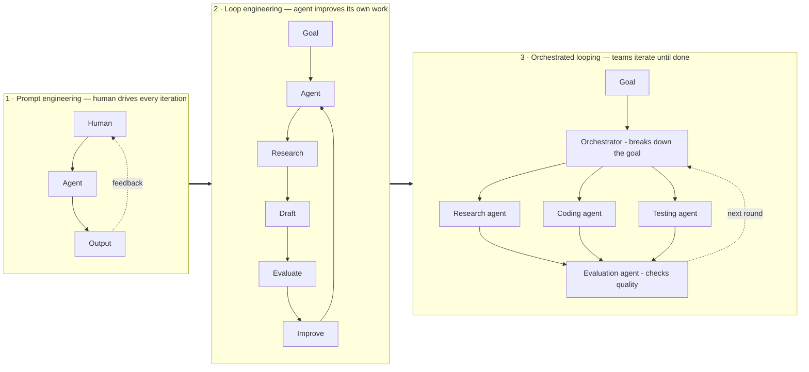

## Goal

Answer the questions a builder actually asks about loops: what *is* loop engineering, what
are its parts, how many loops do I need, how many shapes are there, why is it needed — and do
you have to code one on an SDK, or can
[Claude Code / Codex]() do it? Each question has its
own page; this is the map.

## What it is

**Loop engineering is designing the iteration itself, instead of doing the iterating.**
[Prompt engineering]() shapes *one model
call*; the [harness]() runs *one agent's loop*; loop
engineering designs the **system of loops**: what repeats, who checks the result, what counts
as "done", and what stops it. In one line: you stop being the person who prompts the agent —
you build the thing that prompts the agent.

Crucially, looping is a **way of organising a system, not a model**. It isn't a feature you
switch on; it's a pattern almost any agent framework can run, depending on how you wire the
pieces. That's why the paradigm is shifting from `Prompt → Output` to
`Goal → Loop → Evaluate → Improve → Repeat → Result` — and why both Anthropic and OpenAI now
push engineers to build the loop, not just the prompt.

## The maturity ladder

Each generation fixed the last one's failure — this is the shape of the whole field, and the
map for the pages below:

| Year | Loop | Lesson it taught |
| ------ | ------ | ------ |
| 2022 | **ReAct** — reason → act → observe, one model, one loop | Iteration beats one-shot answers |
| 2023 | **AutoGPT** — goal-seeking loop | Famous for spinning forever → loops need **stop conditions** |
| 2025 | **Ralph loop** — the same prompt re-run against fixed anchor files | Persistent anchors keep long runs coherent |
| Early 2026 | **Productised loops** — a validator decides when work is done | "Done" must be *checked*, not self-declared |
| Mid 2026 | **Orchestration** — a supervisor schedules and coordinates worker loops | One loop doesn't scale; teams of loops do |

## The five pages

| Page | Question it answers |
| ------ | ------ |
| [The parts of a loop]() | What's inside a production loop |
| [The four levels of loops]() | How many loops you need, and what each one buys |
| [Open vs. closed loops]() | Which shape to choose, and when |
| [Fleet looping]() | How looping scales to teams of agents |
| [Building a loop]() | Off-the-shelf tool or your own SDK |

The two framings compose. [Levels]() tell you **how many loops to
wrap** around the work; the axes below describe **each individual loop** you end up with — so
any loop you meet is a point on three independent axes:

| Axis | Options | Detailed in |
| ------ | ------ | ------ |
| **Architecture** | Open (explore) vs closed (measured) | [Open vs. closed]() |
| **Topology** | Single worker vs orchestrated fleet | [Fleet looping]() |
| **Oversight** | Human in / on / out of the loop | [Fleet looping]() |

## Why you need it

- **One-shot calls cap out** — quality comes from iterate-and-verify, and doing that manually
  makes *you* the bottleneck.
- **Trust requires a validator** — unreviewed agent output doesn't ship; a loop with a
  checker turns "plausible" into "verified".
- **Cost control requires closure** — open exploration is unpredictable spend; closed loops
  with thresholds make cost and quality *measurable per run*, so each run can be improved.

> You stop being the person who prompts the agent — you build the thing that prompts the agent.

When orchestration *is* warranted, the structure those coordinated loops run on is a graph —
see [From prompts to graphs]() for where
loop engineering sits in the wider lineage.

## Sources

- Osmani, *Loop Engineering* (2026) — [addyo.substack.com](https://addyo.substack.com/p/loop-engineering)
- Yao et al., *ReAct* (2022) — [arXiv:2210.03629](https://arxiv.org/abs/2210.03629)
- [Anthropic — Effective harnesses for long-running agents](https://www.anthropic.com/engineering/effective-harnesses-for-long-running-agents)
