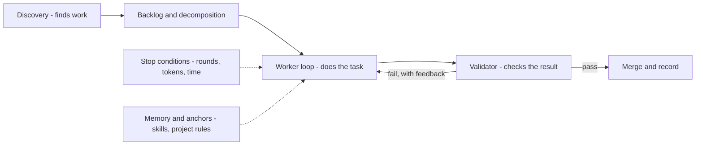

*What's inside a production loop.*

## What it is

A production loop has six parts. The worker — the agent doing the task — is the *least*
interesting one; the parts around it are what turn a demo into something you can trust
unattended.

## The six parts

- **Discovery / automations** — finds work without a human trigger: a schedule, a webhook, a
  scanner. This is what lets a loop run *unattended*.
- **Decomposition** — an orchestrator breaks the goal into tasks a worker can own. See
  [fleet looping]() when this goes multi-level.
- **Worker** — an agent with [tools]() and
  [MCP connectors](); parallel workers get **git worktrees**
  so they don't overwrite each other.
- **Validator** — a second judgment ([LLM-as-judge](),
  a test suite, or both) that decides pass/fail — never the worker grading itself.
- **Stop conditions** — max rounds, token budget, loop detection: the AutoGPT lesson,
  inherited from the [harness]().
- **Memory & anchors** — [skills](), project rules,
  and [agent memory]() so each round builds on the
  last instead of rediscovering it.

## Example

A nightly dependency-update loop: **discovery** is the cron trigger; **decomposition** splits
"update all packages" into one task per package; the **worker** bumps a version and runs the
build; the **validator** is the test suite; **stop conditions** cap it at three fix attempts
per package; **anchors** are the project's upgrade notes so it doesn't re-learn known
breakages. Only the worker is an "agent" — the other five are what make it safe to leave
running overnight.

## Related

- [Open vs. closed loops]() — the validator is what makes a loop *closed*.
- [The agent harness]() — where stop conditions and memory come from.

## Sources

- [Anthropic — Effective harnesses for long-running agents](https://www.anthropic.com/engineering/effective-harnesses-for-long-running-agents)
- [AutoGPT](https://github.com/Significant-Gravitas/AutoGPT) — the goal-seeking loop, and its lessons
