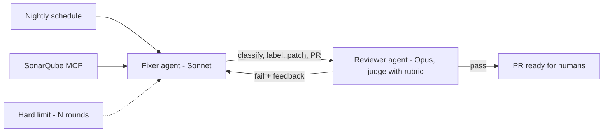

*How you actually build one — and a worked example.*

## SDK, or Claude Code / Codex off the shelf?

The honest answer: **start with the tools — you already own a production-grade loop.**
Claude Code and Codex *are* loop products: harness, tools, skills, MCP, stop conditions all
built in. There's a ladder, and each rung must be earned:

1. **Use the tool interactively** — you are the orchestrator. Fine for daily work.
2. **Script the tool** — run it headless in CI on a schedule with a fixed prompt, skills, and
   MCP servers. This is already loop engineering — no SDK, and it covers most closed-loop
   automation (nightly triage, lint-fix sweeps, doc updates).
3. **Code on an SDK** ([Agent SDK, LangGraph, Microsoft Agent Framework]())
   only when the loop needs what a tool can't give you: **custom topology** (a fixer and a
   reviewer with different models talking to each other), **your own validator logic and
   thresholds**, or the loop *is your product* and needs its own UI, state, and versioning.

Rule of thumb: if your loop is *one worker + a schedule*, script the tool you have. If it's
*several roles negotiating*, that's when an SDK earns its complexity.

## Case study — a static-analysis autofixer

A real closed loop I built when security scans (SonarQube) started piling up minor issues
faster than humans cleared them:

A **fixer** (Sonnet) pulls issues via the SonarQube MCP server, classifies and labels them,
patches the safe ones, and opens a PR. A **reviewer** (Opus) judges the patch against a
rubric; on fail it feeds the reasons back to the fixer — at most N rounds (the hard limit),
then it stops rather than spins. The whole thing runs on a schedule in GitHub Actions,
orchestrated with an agent framework plus skills (guidelines, incremental-implementation,
sonar-guardrails).

Every axis shows up: **closed** loop, human **on** the loop (they review PRs, not steps),
**orchestrated** topology — and it only needed an SDK because two different models negotiate;
the discovery half could have been a scripted coding agent.

## Strengths & limitations

- **Strengths** — throughput without a human bottleneck; a validator makes quality
  *enforced*, not hoped for; closed loops give you a cost ceiling and improve run over run;
  the maker–checker split catches what self-review can't.
- **Limitations** — validators can be gamed or wrong (judge bias — calibrate against human
  labels); loops amplify a bad prompt or rubric at machine speed; orchestration multiplies
  cost and failure modes — most tasks still deserve one worker and a schedule, not a fleet.

## Related

- [The parts of a loop]() — every part above, named.
- [Fleet looping]() — when one worker isn't enough.
- [Tooling & frameworks]() — the SDKs named here.

## Sources

- Osmani, *Loop Engineering* (2026) — [addyo.substack.com](https://addyo.substack.com/p/loop-engineering)
- Huntley, *Ralph Wiggum as a software engineer* — [ghuntley.com/ralph](https://ghuntley.com/ralph/)
- Zheng et al., *Judging LLM-as-a-Judge (MT-Bench)* (2023) — [arXiv:2306.05685](https://arxiv.org/abs/2306.05685)
- [Claude Code — Headless mode](https://code.claude.com/docs/en/headless)
