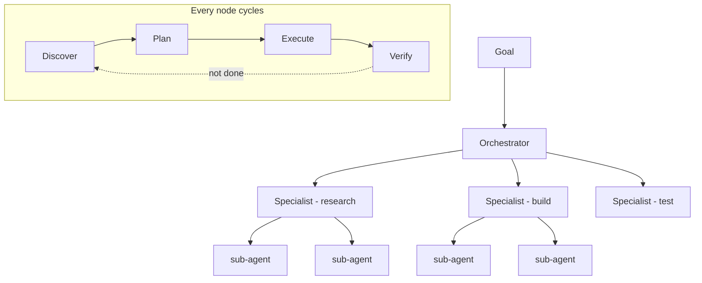

*The topology and oversight axes — scaling looping up.*

## What it is

At the simplest level, one agent loops on its own work: research → draft → evaluate against
the goal → fix the weak spots → repeat until it's good enough. You no longer prompt each step;
the agent runs the loop for you.

**Fleet looping** is that same idea at scale. An **orchestrator** takes the overall goal and
breaks it into parts; it hands each part to a **specialist agent**; each specialist can
further delegate narrower work to its own **sub-agents**. The whole task tree keeps cycling
through four phases until the goal is met:

If a single self-looping agent is **one person** endlessly revising their own draft, a fleet
is **a whole team** running a project end to end. You define the goal; the system runs until
it meets the criteria.

## The two axes it introduces

Fleet looping is where two of the three [loop axes]() come alive:

- **Topology** — **single loop** (one worker; simpler and usually enough) vs **orchestrated**
  (a supervisor plus specialised workers). Orchestrate only when tasks genuinely parallelise
  or need separate *maker* and *checker* roles — a fleet multiplies both cost and failure
  modes.
- **Oversight** — how far you step back:
  - **Human *in* the loop** — approves each step (highest control, lowest throughput).
  - **Human *on* the loop** — monitors and intervenes on exception.
  - **Human *out* of the loop** — reviews outcomes only.

  This is the same ladder as [responsible AI's placements](),
  applied to loops: you graduate from sitting inside one loop to designing loops that watch
  other loops.

## Why it needs discipline

A fleet without **evaluation gates** at each phase produces confident AI slop at scale — many
loops amplifying a bad rubric faster than any human can catch it. The gate (a
[validator]()) is what keeps a fleet's output above the "meets the
standard" bar. That's why most tasks still deserve *one* worker and a schedule, not a fleet:
orchestration is a cost you pay only when the work truly parallelises.

## Example

"Publish a launch article." The orchestrator spawns a **research** specialist (which delegates
sub-agents to gather sources and competitor pages), a **drafting** specialist, and an
**editing** specialist that acts as the evaluation gate. Each cycles discover → plan →
execute → verify; the editor rejects drafts that miss the brief, feeding notes back — until
the piece clears the bar. One goal in, a finished article out, no human writing a single
prompt per step.

## Related

- [Open vs. closed loops]() — the architecture axis; fleets are almost always run closed.
- [From prompts to graphs]() — the structure coordinated loops run on.
- [Multi-agent systems]() — topologies and shared memory for agent teams.

## Sources

- Osmani, *Loop Engineering* (2026) — [addyo.substack.com](https://addyo.substack.com/p/loop-engineering)
- [Anthropic — How we built our multi-agent research system](https://www.anthropic.com/engineering/built-multi-agent-research-system)
