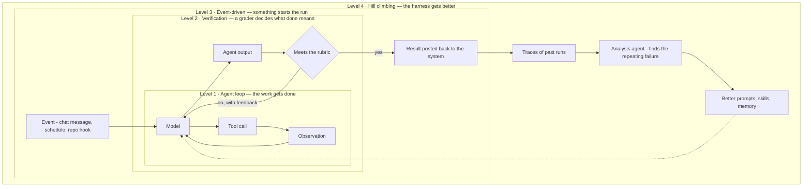

*How many loops you need, and what each one buys.*

## What it is

The four levels are not four kinds of loop. They are **one loop wrapped four times** — each
level surrounds the level below it and adds a property the inner loop cannot produce on its
own. So the question is never "which loop is this?" but **how many do I need?**

## The four levels

| Level | What it adds | What it costs | Detailed in |
| ------ | ------ | ------ | ------ |
| **1 · Agent loop** — the model calls tools until it decides the task is done | Automation | A model call per step | [The agent harness]() |
| **2 · Verification loop** — a grader scores the result against a rubric and sends failures back with feedback | Reliability | Latency and tokens on every retry | [Open vs. closed loops]() |
| **3 · Event-driven loop** — a signal from outside starts the run | Reach — the agent lives where the work already happens | Infrastructure, and the risk of firing on the wrong thing | This page |
| **4 · Hill-climbing loop** — traces from past runs feed an agent that improves the harness | Improvement over time | An [eval set]() you trust | [Self-improving agents]() |

Level 2 also changes the *economics* of level 1. A grader that keeps sending work back is a
correctness budget you can spend elsewhere: a cheaper model plus a strict grader often beats
the strongest model alone, because the grader catches what the cheap model got wrong and the
retries still cost less. You are trading latency for money. See
[choosing a model]() for the tier ladder that trade runs on.

**Level 3 is the one nobody plans for.** A loop nobody starts is a loop nobody uses. The
trigger is a schedule, a message in a chat channel, a repository event (a PR opened, an issue
labelled), an incoming email, or an alert from a scanner. The rule is to put the trigger where
the work already is — an agent that needs people to visit a separate tool is how an internal
agent quietly dies.

## Example — a docs agent, level by level

The same agent, wrapped one level at a time:

- **Level 1** — it clones the repository, reads the current page, writes a new one, and opens
  a pull request with the diff. Useful, but somebody has to ask it, and somebody has to check it.
- **Level 2** — a grader now runs before it reports back: no dead links, and CI green. On a
  fail, the reasons go back to the agent and it tries again. Reviewers stop receiving broken PRs.
- **Level 3** — a message in the team's `#docs-please` channel starts the run, and the finished
  PR is posted back to the same thread. Nobody learns a new tool, so people actually use it.
- **Level 4** — an analysis agent reads the traces of the last hundred runs and notices the
  same failure repeating: the agent keeps missing the style guide, because nothing ever put it
  in context. It proposes adding the guide as a skill. That change is itself a pull request.

Levels 1 to 3 automate the work. Level 4 automates the *improvement of the thing that does
the work* — which is why it compounds and the others don't.

## Where the human goes

Automating the loop is not the same as removing the person. Spend human judgment where it
changes the outcome, and nowhere else:

| Level | Where the human sits | Use it when |
| ------ | ------ | ------ |
| 1 | Approves a sensitive tool call before it runs | The action is irreversible or external — money moves, mail sends, records are deleted |
| 2 | *Is* the grader, or reviews what the grader passed | The rubric is still forming, or the signal is too fuzzy to score automatically |
| 3 | Reviews the finished artifact | The output is a proposal, not an action — a PR, a draft, a plan |
| 4 | Approves changes to the harness before they merge | Always, until the eval set is strong enough to merge on a score |

[Responsible AI]() owns the placements themselves and the
warning that comes with them: a reviewer buried in approvals rubber-stamps, which is worse
than no gate at all.

## Related

- [The parts of a loop]() — the six components inside any one level.
- [Open vs. closed loops]() — level 2 is what makes a loop closed.
- [Self-improving agents]() — how level 4 actually works.

## Sources

- Runkle, *The Art of Loop Engineering* (2026) — [langchain.com](https://www.langchain.com/blog/the-art-of-loop-engineering)
- [Anthropic — Effective harnesses for long-running agents](https://www.anthropic.com/engineering/effective-harnesses-for-long-running-agents)
