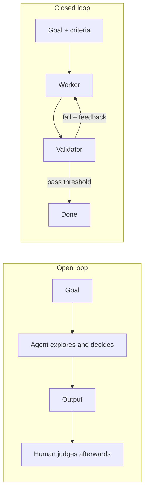

*The architecture axis — which shape to choose, and when.*

## What it is

The names come from control theory: a **closed** loop feeds its output back and corrects
against a reference; an **open** loop runs without that feedback path. For agents:

- **Open loop** — the agent gets a goal and freedom: it explores, reasons, and decides its
  own next steps. There are no predefined success criteria; the run ends when the agent
  declares itself done or the budget runs out, and a *human* judges the output afterwards.
- **Closed loop** — the goal ships with **explicit success criteria and a validator** defined
  *before* the run. Every iteration is measured against them; failures feed back into the
  next round; "done" means *the threshold was passed*, not "the agent felt finished".

| Question | Open loop | Closed loop |
| ------ | ------ | ------ |
| Who decides the next step? | The model, at runtime | The process, designed upfront |
| What does "done" mean? | Agent self-declares, or budget dies | Validator passes a threshold |
| Cost per run | Unpredictable | Bounded (rounds × budget) |
| Result across runs | Varies | Repeatable |
| Can it improve? | Hard — nothing is measured | Run over run — every run is scored |
| Main risk | Token burn, drift, quality by luck | A wrong rubric gets enforced at machine speed; solutions outside the frame get missed |

## When to choose which

**Choose open when** the problem itself is unexplored: you don't yet know what "good" looks
like, it's a one-off spike ("figure out why these tests are flaky", "map this legacy
codebase"), and a human will read the output directly. Exploration is the one thing a closed
loop *can't* do — its criteria would have to exist already.

**Choose closed when** the task repeats, runs unattended (CI, schedules), spends real money,
or its output ships without a human watching every step. Production defaults to closed for
exactly those reasons.

## They're stages, not rivals

The two aren't rivals — they're **stages of the same lifecycle**: run the task open a few
times to *discover* the criteria, then freeze those criteria into a validator and close the
loop. The [autofixer case study]() went exactly this way:
the first fixes were exploratory and hand-reviewed; once the review rubric stabilised, it
became the reviewer agent's rubric.

> Open to explore, closed to operate — a task that repeats enough deserves to be closed.

## Related

- [The parts of a loop]() — the validator is what makes "closed" possible.
- [Fleet looping]() — the other two axes: topology and oversight.

## Sources

- Yao et al., *ReAct* (2022) — [arXiv:2210.03629](https://arxiv.org/abs/2210.03629)
- [AutoGPT](https://github.com/Significant-Gravitas/AutoGPT) — what an unbounded open loop looks like
