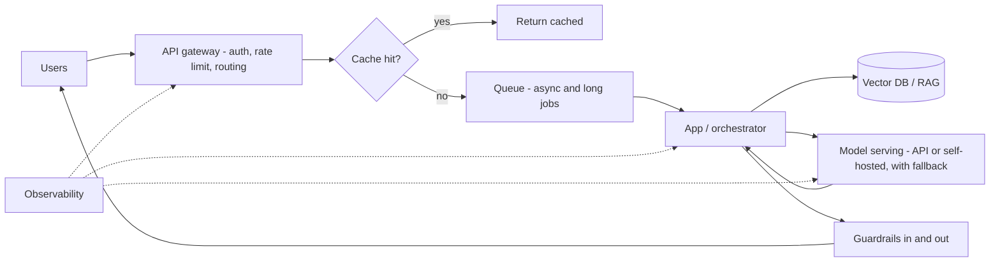

## Goal

A working API call is the *start*. Once an AI app has real users, new problems appear:
latency climbs, token cost balloons, the model provider rate-limits you, and one failure
takes the whole request down. This page is the **advanced** half of
[AI system design]() — the infrastructure layer
that makes an app fast, affordable, and reliable at scale.

## The story: 10 users → 10,000 users

A [RAG chatbot]() that's perfect for 10 users breaks
in predictable ways at 10,000. Each pattern below fixes one specific break:

## The request path

**API gateway** — the single front door. It authenticates, enforces **rate limits** (so one
user can't exhaust your provider quota), and **routes** requests. For AI apps its most
valuable job is **multi-provider routing**: send traffic to a primary model, fail over to a
secondary when the primary is down or throttled, and route cheap requests to a cheap model.

**Load balancing** — spread requests across app instances (and across provider API keys /
regions) so no single one is the bottleneck. AI twist: balance by *token load*, not just
request count — one long-context request can cost 100× a short one.

## Caching — the cheapest request is the one you don't send

Two layers, different keys:

- **Exact cache** — same input string → return the stored answer. Trivial and free; only hits
  identical repeats.
- **Semantic cache** — [embed]() the query and reuse a
  past answer when a new question is *close enough* in meaning ("what's your refund window?" ≈
  "how long do I have to return something?"). Catches paraphrases an exact cache misses.
- **Prompt cache** — a provider feature: reuse a repeated prompt *prefix* (system prompt, big
  context) to cut latency and cost on every call. Different from the two above — it caches
  *inside* one request path, not across users.

Cache what's stable (docs, FAQs). Don't cache what must be fresh or per-user (account data,
anything with a [guardrail]() decision) — a stale
cached answer to the wrong user is worse than a slow one.

## Model serving

**Managed API** (Claude, GPT) is the default: no GPUs, instant scale, pay per token. Reach for
**self-hosting** an open model only when you have a concrete reason — data can't leave your
network, extreme volume makes per-token pricing lose to fixed GPU cost, or you need a
fine-tuned model in the loop. Self-hosting buys control and costs you ops: GPU capacity,
**batching** (group concurrent requests through the GPU for throughput), and autoscaling
become *your* problem. Most teams should stay on the API far longer than they think.

## Queues and async

A model call can take seconds to minutes — too long to hold an HTTP request open at scale. Put
long or bursty work on a **queue**: the request returns immediately with a job id, a worker
pool processes the queue, and the client polls or gets a webhook. This absorbs traffic spikes
(the queue buffers instead of the app falling over) and lets you cap concurrency to what your
provider quota allows. Essential for [agent]() and
batch workloads; a short single-shot chat can stay synchronous.

## Reliability

Models fail, time out, and rate-limit — design for it:

- **Timeouts + retries** with backoff — but retry only idempotent calls, and cap attempts so a
  provider outage doesn't amplify into a self-inflicted flood.
- **Fallback** — primary model errors → try a secondary provider or a smaller model.
- **Circuit breaker** — after repeated failures to a provider, stop calling it for a cooldown
  instead of hammering a dead endpoint.
- **Graceful degradation** — when the AI path is fully down, return *something* useful:
  cached results, keyword search instead of RAG, or an honest "try again shortly" — never a
  100% outage because one model is unavailable.

## Cost and capacity at scale

[Cost per call]() is a Stage 0 topic; at scale it
becomes a *system* concern: route easy requests to cheap models, cache aggressively, cap
context size, and batch where latency allows. Track cost per request in
[observability]() so a prompt change that doubles
tokens shows up as a bill, not a surprise. Set a per-user and global budget ceiling — an
[agent loop]() with no cost cap is an open wallet.

## Example — the chatbot, scaled

The 10-user chatbot at 10,000 users: an **API gateway** rate-limits and fails over between two
model providers; a **semantic cache** serves ~30% of questions with zero model calls; long
answers go through a **queue** so spikes don't topple the app; a **circuit breaker** + fallback
to a smaller model keeps it up during a provider incident (degraded, not down); and
**per-request cost traces** catch the day someone's prompt tweak doubles spend. Same product —
now it survives contact with real traffic.

## Strengths & limitations

- **Strengths** — these patterns are the difference between a demo and a service: predictable
  latency, a cost ceiling, and uptime that survives a provider outage.
- **Limitations** — every layer is complexity you must run and debug; a cache serves stale
  answers if invalidation is wrong; aggressive fallback can hide quality drops (a cheaper model
  answering silently). Add each layer when a real symptom demands it — not upfront. The
  [right-sized-stack]() rule applies here most of
  all.

## Sources

- [AWS — Generative AI Lens (Well-Architected)](https://docs.aws.amazon.com/wellarchitected/latest/generative-ai-lens/generative-ai-lens.html)
- [Google Cloud — AI and ML architecture guides](https://cloud.google.com/architecture/ai-ml)
- Fowler, *CircuitBreaker* — [martinfowler.com](https://martinfowler.com/bliki/CircuitBreaker.html)
- [Anthropic — Prompt caching](https://platform.claude.com/docs/en/build-with-claude/prompt-caching)
- [Anthropic — Service tiers (rate limits & priority)](https://platform.claude.com/docs/en/api/service-tiers)
