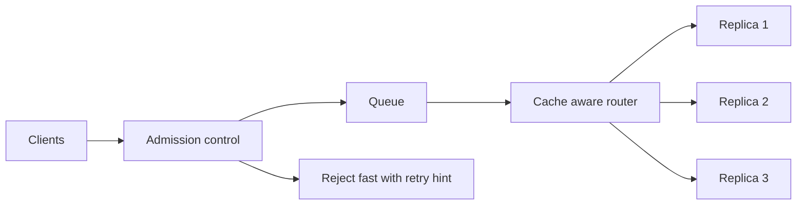

*The front door, and what it does when too many people arrive.*

## Goal

Keep a fleet of model replicas fast and honest under bursty traffic: decide what to admit, what
to queue, what to reject, and which replica each request should go to. This page deepens
[§Queues and async]() for the self-hosted case.

## Why the usual load balancer is wrong here

A web load balancer assumes requests are short, cheap, and interchangeable. Model requests are
none of those:

| Assumption | Reality for inference |
| ------ | ------ |
| Requests take milliseconds | They take seconds to minutes |
| Cost per request is uniform | A 200-token and a 100k-token prompt differ by 500× |
| Any replica is equally good | The replica holding your prefix in cache is far cheaper |
| CPU shows saturation | A GPU pinned at 100% may still have capacity, or none |
| Round-robin spreads load evenly | It spreads *requests* evenly and *load* terribly |

So the interesting decisions move from "pick a backend" to **"should this run now, and where."**

## Admission control and backpressure

The queue is not a place to hide an overload — an unbounded queue turns a capacity problem into
a latency problem, and every request in it eventually times out anyway. Serve work you can
finish:

- **Bound the queue.** Past the limit, reject immediately with a `429` and a `Retry-After`. A
  fast, honest rejection is better service than a request that waits 90 seconds and then fails.
- **Set a queue-time budget.** Drop requests that have waited longer than the client will, and
  stop paying to compute answers nobody is still listening for.
- **Estimate cost before admitting.** Prompt tokens are known up front and `max_tokens` bounds
  the rest, so you can reject a request that cannot possibly fit your latency target.
- **Separate the queues.** Interactive chat and overnight batch should not share a line. Give
  each its own queue and concurrency budget, or the batch job will starve your users.

**Backpressure must reach the caller.** If your API accepts everything and silently buffers,
clients keep sending and the collapse is just delayed — and worse, invisible until it is total.

## Cache-aware routing

This is the one big inference-specific win. Because a
[serving engine]() caches KV state for prompt prefixes,
routing a request to the replica that already holds its prefix skips most of prefill.

- **Sticky by prefix / session** — hash the system prompt or conversation id and send matching
  requests to the same replica. Enormous for multi-turn chat and
  [agent loops](), where each turn resends a nearly
  identical context.
- **Least-pending, not round-robin** — route by each replica's queue depth and KV-cache
  occupancy, the metrics that actually reflect load.
- **Keep an escape hatch** — stickiness that survives a hot replica becoming overloaded is a
  bug. Fall back to the least-loaded replica when the preferred one is saturated.

## Autoscale on the right signal

GPU utilisation is a poor scaling signal: a decode-bound replica shows high utilisation while
mostly waiting on memory. Scale on what users feel:

| Signal | Why it works |
| ------ | ------ |
| **Queue depth / queue wait time** | Directly proportional to the latency users experience |
| **KV cache occupancy** | The real capacity ceiling — when it is full, concurrency stops |
| **Time to first token** | The user-visible symptom of prefill contention |

Two cautions. GPU replicas take **minutes** to become ready — model download, load, and
warm-up — so scale on a leading indicator and keep warm headroom; reactive scaling arrives
after the spike is over. And scale *down* slowly: flapping a GPU pool is expensive in both
money and cold starts.

## Strengths & limitations

- **Strengths** — a bounded queue plus admission control converts a total collapse into
  graceful, honest degradation; cache-aware routing is close to free throughput on prefix-heavy
  workloads; queue-depth autoscaling tracks user experience far better than CPU or GPU
  utilisation.
- **Limitations** — every layer adds latency and another thing to operate; stickiness fights
  even load balancing and needs an override; queue-time budgets and admission thresholds are
  workload-specific and must be tuned with real traffic; and none of this helps if a single
  replica is misconfigured — it will just distribute the problem evenly.

## Where to go next

- The provider or model itself fails → [Routing & fallback]().
- Tune the replica before adding more → [Serving engines]().
- What to instrument → [Observability]().

## Sources

- Yu et al., *Orca: A Distributed Serving System for Transformer-Based Generative Models* (OSDI, 2022) — [usenix.org](https://www.usenix.org/conference/osdi22/presentation/yu)
- Zheng et al., *SGLang: Efficient Execution of Structured Language Model Programs* (2023) — [arXiv:2312.07104](https://arxiv.org/abs/2312.07104)
- [vLLM — Production metrics](https://docs.vllm.ai/en/latest/usage/metrics.html)
- [Google SRE Book — Handling overload](https://sre.google/sre-book/handling-overload/)
