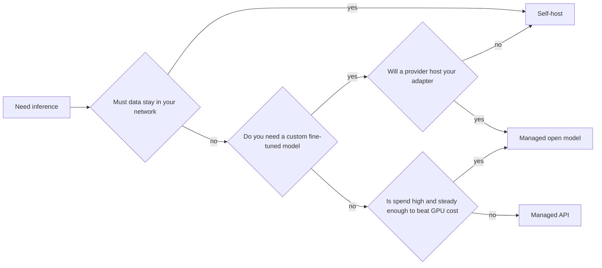

*The gate for this whole section.*

## Goal

Decide honestly whether to self-host an open model or stay on a managed API. This is the most
expensive decision in the section, it is usually made for the wrong reason, and every other
page here only matters if you answer "self-host."

## The three options

| Option | What you run | What you pay for | Scales by |
| ------ | ------ | ------ | ------ |
| **Managed API** | Nothing | Tokens | Someone else's problem |
| **Managed open model** | Nothing; an open model on a provider's GPUs | Tokens, or GPU-hours | Provider autoscaling |
| **Self-hosted** | Weights, engine, GPUs, the lot | GPU-hours, whether or not you use them | You, deliberately |

The middle row is the one people forget. Providers serve open weights per-token, which gets you
model choice and portability without owning a single GPU. **It is the right first step away
from a closed API — not a jump straight to your own cluster.**

## The three reasons that justify self-hosting

Only three hold up. If your reason is not on this list, it is probably a preference.

- **Data residency** — the text legally cannot leave your network. Regulated industries, some
  government work, some EU data agreements. This is the only reason that is not a trade-off:
  it is a constraint, and it settles the question by itself.
- **Volume economics** — per-token pricing is a rental. Above some steady throughput, owning
  or reserving GPUs is cheaper. The key word is *steady*: GPUs bill while idle, so bursty
  traffic destroys the arithmetic that made self-hosting look good.
- **A model no one will serve you** — a fine-tune, a merge, a research model, or one with a
  licence that keeps it off managed platforms. See
  [Adaptation]() before assuming you need this.

Reasons that do **not** justify it: latency (a nearby managed region usually wins), cost at low
volume (it never wins), privacy as a feeling rather than a contract term (read the provider's
zero-retention terms first), and "we want control" without naming what you would do with it.

## Sizing the hardware

The first number is **VRAM for the weights**: roughly *parameters × bytes per parameter*.
At FP16 that is 2 bytes each, so a 7B model needs ~14 GB before anything else.

| Model size | FP16 | INT8 | INT4 |
| ------ | ------ | ------ | ------ |
| 7B | ~14 GB | ~7 GB | ~4 GB |
| 13B | ~26 GB | ~13 GB | ~7 GB |
| 70B | ~140 GB | ~70 GB | ~35 GB |

Then add the part that surprises people: the **KV cache**, the per-request memory holding
attention state for every token in flight. It grows with context length *and* with the number
of concurrent requests, and at high concurrency it can rival the weights themselves. A model
that "fits in 24 GB" may fit exactly one user.

This is why the next page exists: [quantization]() is how you
buy back the headroom, and [serving engines]() is how you
stop the KV cache from wasting it.

## The costs nobody puts in the spreadsheet

The comparison is usually written as *GPU-hours vs token spend*, and that is the easy half:

- **Idle time.** A managed API costs nothing at 3 a.m. A reserved GPU costs the same at 3 a.m.
  as at peak. Compare against your *average* utilisation, not your peak.
- **Ops.** Driver and CUDA versions, engine upgrades, OOM crashes at 2 a.m., capacity planning,
  and a rollback story. This is a standing engineering cost, not a one-off setup.
- **Model upgrades.** Providers ship a better model and you change a string. Self-hosted, you
  re-benchmark, re-quantize, re-tune, and redeploy.
- **The quality gap.** Open weights have closed much of the distance, but on the hardest
  reasoning and tool-use work the frontier closed models are still ahead. Measure it on
  *your* [eval set]() before committing.

## Strengths & limitations

- **Strengths of self-hosting** — data never leaves; fixed, predictable cost at steady high
  volume; any model you like, including your own fine-tunes; no provider rate limits or
  deprecation schedule.
- **Limitations** — real ops burden; idle GPUs bill anyway; you own every failure; the quality
  ceiling is whatever open weights offer today; and the break-even point is far higher than
  most teams estimate, because the spreadsheet usually omits everything in the section above.

> Stay on the managed API until you can name which of the three reasons applies to you.

## Where to go next

- You are self-hosting → [Quantization]() to make the model fit.
- You are staying on an API → [Routing & fallback](),
  which applies unchanged.
- Choosing *which* model, self-hosted or not → [Choosing a model]().

## Sources

- [Hugging Face — Model memory anatomy](https://huggingface.co/docs/transformers/model_memory_anatomy)
- [vLLM — Conserving memory and KV cache configuration](https://docs.vllm.ai/en/latest/configuration/conserving_memory.html)
- Kwon et al., *Efficient Memory Management for Large Language Model Serving with PagedAttention* (2023) — [arXiv:2309.06180](https://arxiv.org/abs/2309.06180)
