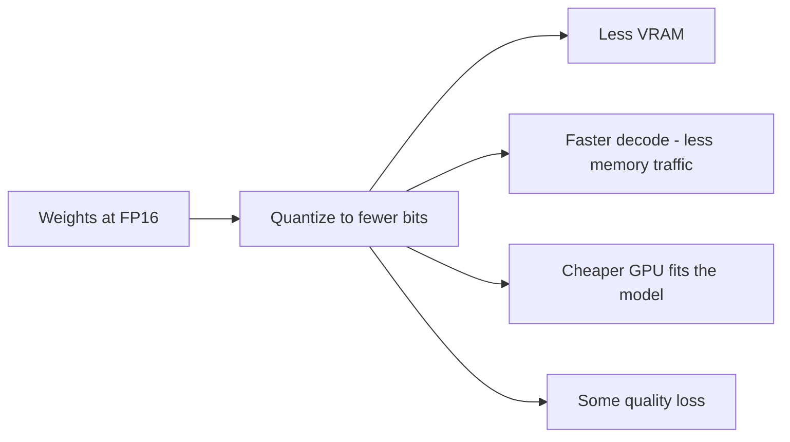

*How a model that needs 140 GB runs on a 48 GB card.*

## Goal

Understand the one lever that decides whether a model fits your hardware at all, what it costs
you in quality, and which of the confusing format names — AWQ, GPTQ, GGUF — you actually need.

## What it is

A model's weights are numbers. Training produces them at high precision; **inference rarely
needs that precision**. Quantization stores each weight in fewer bits — 16 down to 8, or 4 —
and dequantizes on the fly during the matrix multiplications.

You get three things at once, and pay for them in one currency:

Speed is the part people miss. Token generation is **memory-bandwidth bound**, not
compute-bound: the GPU reads the entire weight set for every token it produces. Halve the
bytes and you roughly halve the reading, which is why INT4 decodes faster than FP16 on the
same card even though the arithmetic is no simpler.

## The precision ladder

| Precision | Bits | Memory vs FP16 | Typical quality | Use it for |
| ------ | ------ | ------ | ------ | ------ |
| **FP32** | 32 | 2× more | Reference | Training, almost never inference |
| **FP16 / BF16** | 16 | baseline | The baseline everything is measured against | The default serving precision |
| **FP8** | 8 | 0.5× | Near-lossless on modern hardware | Newer NVIDIA GPUs with native support |
| **INT8** | 8 | 0.5× | Very close to baseline | The safe production choice |
| **INT4** | 4 | 0.25× | Noticeable but often acceptable | Fitting a big model on a small card |
| **INT3 / INT2** | 3–2 | 0.19× / 0.13× | Degrades badly | Experiments, not production |

**BF16 vs FP16**: same 16 bits, split differently. BF16 keeps FP32's exponent range with less
mantissa, so it rarely overflows — it is the safer default where hardware supports it.

The honest shape of the curve: FP16 → INT8 costs almost nothing. INT8 → INT4 is where you start
trading real quality, and it hurts small models much more than large ones. **A 70B model at INT4
generally beats a 13B model at FP16 on the same VRAM budget** — when you must choose, take the
bigger model at lower precision.

## The three formats

This is the part that confuses people, because the three names are not the same *kind* of thing.

| Format | What it is | Runs on | Reach for it when |
| ------ | ------ | ------ | ------ |
| **GPTQ** | A post-training quantization *algorithm*, layer-by-layer, using a calibration set | GPU | You want mature 4-bit GPU support and broad tooling |
| **AWQ** | An *algorithm* that protects the ~1% of weights the activations care about most | GPU | You want better 4-bit quality than GPTQ, and fast kernels |
| **GGUF** | A *file format* / container, from `llama.cpp`, holding weights at many quantization levels | CPU, Apple Silicon, GPU offload | You are running locally, on a Mac, or without a CUDA GPU |

So GPTQ and AWQ answer *"how were the weights rounded?"*; GGUF answers *"what file is this, and
what runs it?"*. Comparing AWQ to GGUF is comparing a method to a container.

**AWQ's idea in one line**: not all weights matter equally — a small fraction, identified by
looking at *activation* magnitudes rather than the weights themselves, carries most of the
quality, so scale those before rounding and the damage drops. In practice AWQ usually edges out
GPTQ at the same bit width, and both are far better than naive round-to-nearest.

**GGUF k-quants**: inside GGUF you will see names like `Q4_K_M` or `Q5_K_S`. Read them as
*bits · k-quant · size variant* — `Q4_K_M` is 4-bit, k-quant, medium. The k-quants mix
precisions across a tensor, spending more bits where they matter. `Q4_K_M` is the usual
recommended default; `Q5_K_M` if you have the room; below `Q4` only if you must.

## What to measure

Quantization is the one change in this section that can silently make your product worse, so
never ship it on vibes. Before and after, on the same inputs:

- **Your eval set** — task accuracy on real queries, not a public benchmark. See
  [Evaluation in practice]().
- **Tokens per second** at your real concurrency, not single-stream.
- **Peak VRAM** including the KV cache under load, not just the weights at rest.
- **Format adherence** — quantized models degrade at
  [structured output]() and tool calling noticeably
  earlier than they degrade at prose. If an [agent]()
  depends on clean JSON, test that specifically.

That last point is the practical trap: a 4-bit model that still writes fluent paragraphs may
have quietly become unreliable at emitting a valid tool call.

## Strengths & limitations

- **Strengths** — 2–4× memory reduction turns an impossible deployment into a cheap one; faster
  decode as a free side effect; INT8 is close to lossless; pre-quantized checkpoints mean you
  usually download rather than compute anything.
- **Limitations** — quality loss is real, task-dependent, and worst on small models, long
  contexts, and structured output; the format must match your serving engine and GPU;
  quantizing yourself needs a calibration set and GPU hours; and it does nothing for the KV
  cache, which is often what actually ran you out of memory.

## Where to go next

- Put an engine in front of the quantized weights → [Serving engines]().
- Decide whether you should be self-hosting at all → [Local vs cloud]().
- Change the model's behaviour, not its precision → [Adaptation]().

## Sources

- Frantar et al., *GPTQ: Accurate Post-Training Quantization for Generative Pre-trained Transformers* (2022) — [arXiv:2210.17323](https://arxiv.org/abs/2210.17323)
- Lin et al., *AWQ: Activation-aware Weight Quantization for LLM Compression and Acceleration* (2023) — [arXiv:2306.00978](https://arxiv.org/abs/2306.00978)
- Dettmers et al., *LLM.int8(): 8-bit Matrix Multiplication for Transformers at Scale* (2022) — [arXiv:2208.07339](https://arxiv.org/abs/2208.07339)
- Dettmers & Zettlemoyer, *The case for 4-bit precision: k-bit Inference Scaling Laws* (2022) — [arXiv:2212.09720](https://arxiv.org/abs/2212.09720)
- [llama.cpp — GGUF file format specification](https://github.com/ggml-org/ggml/blob/master/docs/gguf.md)
