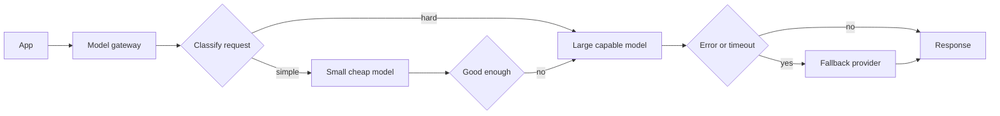

*The two patterns every production AI app needs — self-hosted or not.*

## Goal

Stop treating "the model" as one fixed dependency. Route each request to the cheapest model
that can handle it, and degrade gracefully when a model is overloaded, rate-limited, or gone.
This page deepens [§Reliability]() and applies
unchanged whether you self-host or call a managed API.

## The gateway

Both patterns live in one place: a **model gateway** between your app and every model, so that
"which model answers" becomes a policy decision rather than a constant scattered through your
code.

Build this as a thin internal layer, not a rewrite: one function that takes a request and
returns a response, owning the model choice, the retry, and the fallback chain.

## Routing — the right model per request

Most traffic does not need your best model. Classification, extraction, routing, summarising,
and reformatting are handled well by small models at a fraction of the cost and latency.

| Strategy | How it decides | Good for | Watch out for |
| ------ | ------ | ------ | ------ |
| **Static by task** | The call site says which model | Clear, distinct workloads | Drifts out of date as models change |
| **Escalation / cascade** | Try the cheap model, escalate if the answer fails a check | Mixed difficulty in one endpoint | Two calls when it escalates — the check must be cheaper than the saving |
| **Classifier** | A tiny model or heuristic labels difficulty first | High volume, wide difficulty spread | The classifier is now a thing to evaluate |
| **Capability** | Needs vision, tools, a long context, or JSON | Multimodal and agentic apps | Config sprawl |

**Escalation is the highest-leverage version**, and it lives or dies on the check: a
[grader](), a schema validation, a
confidence signal, or a retrieval-grounding test. If deciding costs as much as the big model,
the cascade has bought you nothing.

Two rules that keep this honest. **Route on a measured difference, not a guess** — build the
routing policy against your [eval set](), and
re-check it when models change. And **log which model served each request**, or you will be
debugging a quality complaint with no idea what produced the answer.

## Fallback — surviving failure

Models fail in five distinguishable ways, and they do not want the same response:

| Failure | Right response |
| ------ | ------ |
| **Rate limit (429)** | Back off and retry, honour `Retry-After`, then shed to another provider |
| **Timeout / slow** | Cancel and retry once elsewhere — do not stack retries on a struggling endpoint |
| **Server error (5xx)** | Retry with jitter, then trip the circuit breaker |
| **Content filter / refusal** | Do *not* retry blindly — it will refuse again. Surface it or reroute deliberately |
| **Bad output (invalid JSON)** | Retry once with the error fed back; then fall back to a stricter or larger model |

The mechanics that make this safe:

- **Retry with exponential backoff and jitter**, capped. Uncapped retries during a provider
  outage turn one failure into a self-inflicted flood.
- **Circuit breaker.** After repeated failures, stop calling that endpoint for a cooldown and
  fail fast to the fallback. Hammering a dead provider only spends your own latency budget.
- **Hedged requests, carefully.** Firing a second call when the first exceeds its p95 cuts tail
  latency but multiplies cost — cap it to a small fraction of traffic.
- **Idempotency.** Retries are only safe if a duplicated call cannot double-charge or
  double-write. Pass a request key and make tool side effects idempotent, especially inside an
  [agent loop]().

## Graceful degradation

The last line of defence is deciding what "broken" looks like to the user. In descending order
of quality: cached answer → smaller or older model → non-AI path (keyword search instead of
[RAG](), a template instead of a generated summary) → an honest error
that says when to come back.

**Never let one provider's outage become a 100% outage.** Design the degraded path before you
need it, and exercise it — an untested fallback is not a fallback.

> Decide in advance which is worse for your users: a slower answer, a weaker answer, or no
> answer. Every choice on this page follows from that.

## Strengths & limitations

- **Strengths** — routing often cuts spend substantially with no quality loss on easy traffic;
  fallback removes the single point of failure; the gateway centralises cost tracking, logging,
  and model swaps in one place.
- **Limitations** — answers now vary by which model served them, which complicates evaluation
  and reproducibility; cascades add latency when they escalate; every provider added is another
  contract, prompt format, and behaviour to maintain; and prompts tuned for one model are
  rarely optimal on its fallback, so quality on the degraded path must itself be measured.

## Where to go next

- The fleet-level view of this → [Load balancing & queuing]().
- The wider production picture → [Scaling to production]().
- Track cost and model choice per request → [Observability]().
- Pick the models you route between → [Choosing a model]().

## Sources

- Chen et al., *FrugalGPT: How to Use Large Language Models While Reducing Cost and Improving Performance* (2023) — [arXiv:2305.05176](https://arxiv.org/abs/2305.05176)
- Ong et al., *RouteLLM: Learning to Route LLMs with Preference Data* (2024) — [arXiv:2406.18665](https://arxiv.org/abs/2406.18665)
- Dean & Barroso, *The Tail at Scale* (CACM, 2013) — [doi:10.1145/2408776.2408794](https://doi.org/10.1145/2408776.2408794)
- [Google SRE Book — Addressing cascading failures](https://sre.google/sre-book/addressing-cascading-failures/)
