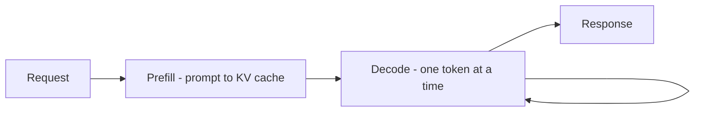
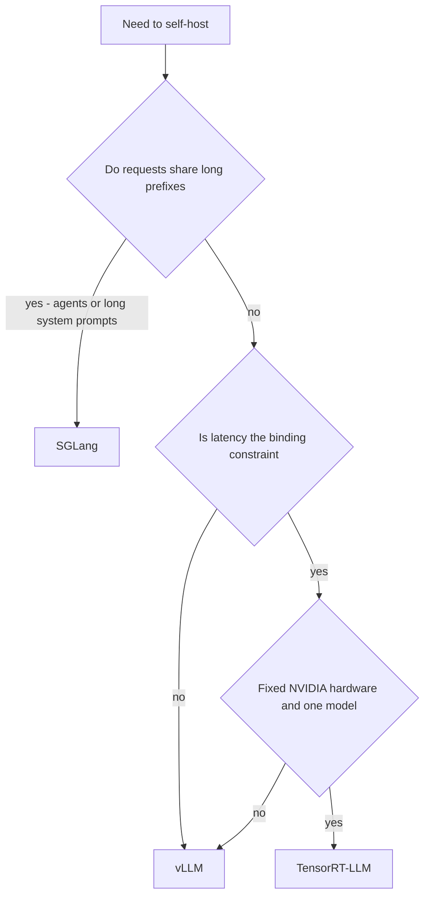

*Why the same GPU serves 5 users or 100, depending on the software in front of it.*

## Goal

Understand what a serving engine actually does, why it is worth 5–20× the throughput of a
straightforward generation loop, and how to choose between the three engines that matter.

## The two phases of a request

Every generation splits into two phases with completely different performance characters, and
almost everything an engine does follows from this split:

| Phase | What happens | Bound by | Cost shape |
| ------ | ------ | ------ | ------ |
| **Prefill** | Process the whole prompt at once, fill the KV cache | Compute | One big parallel pass |
| **Decode** | Emit one token, append to the KV cache, repeat | Memory bandwidth | Hundreds of tiny sequential passes |

Prefill is a sprint; decode is a long walk. During decode the GPU is mostly *waiting on memory*
while its compute units idle — which is exactly the gap an engine fills by running many
requests' decode steps together.

## What an engine buys you

Three ideas do most of the work:

- **Continuous batching.** Static batching waits for a whole batch to finish before starting
  the next, so one long generation holds nine short ones hostage. Continuous batching works at
  *token* granularity: the moment a sequence finishes, a queued request takes its slot. This
  alone is the single largest throughput win.
- **PagedAttention.** The KV cache used to be allocated as one contiguous block per request,
  sized for the worst case — wasting most of it. vLLM borrowed virtual memory's trick: split
  the cache into fixed-size *pages*, allocate on demand, share pages between sequences with a
  common prefix. Waste drops from ~60–80% to a few percent, and that recovered memory becomes
  concurrency.
- **Prefix reuse.** Requests sharing a leading prefix — a long system prompt, a few-shot block,
  a conversation history — can share its KV cache instead of recomputing it. When your prompts
  have a big fixed head, this cuts prefill dramatically.

The result is that throughput is mostly a *memory management* problem, not a math problem. An
engine is worth far more than a faster GPU.

## The three engines

| Engine | Core idea | Hardware | Strongest at | Cost |
| ------ | ------ | ------ | ------ | ------ |
| **vLLM** | PagedAttention + continuous batching | NVIDIA, AMD, others | General-purpose serving; the default | Little — easiest to adopt |
| **TensorRT-LLM** | Ahead-of-time compiled, hardware-specific kernels | NVIDIA only | Squeezing the last 20–40% of latency out of known hardware | A build step per model *and* per GPU; rigid |
| **SGLang** | RadixAttention — a prefix tree over the KV cache | NVIDIA, AMD | Heavy shared prefixes: agents, many-turn chat, structured programs | Newer, smaller ecosystem |

**RadixAttention in one line**: keep the cached prefixes in a radix tree so *any* new request
automatically reuses the longest matching prefix already in memory, instead of only handling
the one prefix you told it to cache. That is why it shines for
[agent loops](), where every iteration resends a
long and largely identical context.

## Choosing one

**Start with vLLM.** It is the honest default: broad model support, good throughput out of the
box, and the least operational surprise. Move to TensorRT-LLM only when you have measured a
latency target you are missing on hardware you control and will not change soon. Reach for
SGLang when your workload is prefix-heavy, where it wins by construction rather than by tuning.

## The knobs that matter

Whichever engine you pick, the same few dials decide behaviour:

- **Max concurrent sequences** — how many requests share the GPU. Too high and per-user latency
  collapses; too low and the GPU idles.
- **KV cache memory fraction** — how much VRAM the cache may claim. Raising it buys concurrency
  and takes room the weights may need.
- **Max context length** — caps the worst-case cache per request. Advertising a 128k window you
  cannot serve at concurrency is a common self-inflicted outage.
- **Tensor parallelism** — split one model across several GPUs when it will not fit on one.

Every one of these is the same trade: **more concurrency, worse tail latency**. Decide which
you are optimising before you touch them, and watch both in
[observability]().

## Strengths & limitations

- **Strengths** — order-of-magnitude throughput over a naive loop; near-complete recovery of
  wasted KV memory; OpenAI-compatible endpoints in all three, so your app code barely changes.
- **Limitations** — one more system to run, tune, and upgrade; throughput gains come from
  batching, which *raises* single-request latency; model and quantization format support varies
  per engine; and a compiled engine like TensorRT-LLM must be rebuilt for every model and GPU
  change, which is a real release-process cost.

## Where to go next

- One replica is not enough → [Load balancing & queuing]().
- Make the weights fit first → [Quantization]().
- The system around the engine → [Scaling to production]().

## Sources

- Kwon et al., *Efficient Memory Management for Large Language Model Serving with PagedAttention* (2023) — [arXiv:2309.06180](https://arxiv.org/abs/2309.06180)
- Zheng et al., *SGLang: Efficient Execution of Structured Language Model Programs* (2023) — [arXiv:2312.07104](https://arxiv.org/abs/2312.07104)
- Yu et al., *Orca: A Distributed Serving System for Transformer-Based Generative Models* (OSDI, 2022) — [usenix.org](https://www.usenix.org/conference/osdi22/presentation/yu)
- [vLLM documentation](https://docs.vllm.ai/)
- [NVIDIA TensorRT-LLM documentation](https://nvidia.github.io/TensorRT-LLM/)
