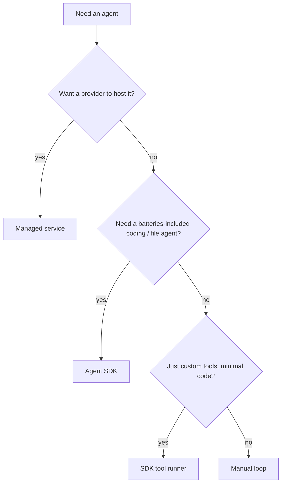

Expands the "build vs. buy" note from
[The agent harness](). You rarely build an agent from
scratch — there's a ladder from *write everything* to *a provider runs it for you*.

## Four ways to build an agent

| Approach | You write | Harness & hosting | Reach for it when |
| ---------- | ----------- | ------------------- | ------------------- |
| **Manual loop** | the reason → act → observe loop yourself | you build + you host | you want total control, no dependency |
| **SDK tool runner** | just your tool functions | SDK runs the loop; you host | a custom-tool agent without hand-writing the loop |
| **Agent SDK** | a prompt + config | SDK is a full harness with built-in tools; you host | a batteries-included coding / file agent on your infra |
| **Managed service** | agent config + tool results | provider runs the loop *and* hosts a sandbox | you want no infra: hosted, stateful, scheduled |

Concrete examples: the **Anthropic API SDK's Tool Runner** (`client.beta.messages.tool_runner`)
is a tool runner; the **Claude Agent SDK** is an Agent SDK (Claude Code packaged as a library);
**Anthropic Managed Agents** is a managed service.

## Don't confuse: Tool Runner vs. Agent SDK

They sound alike but differ:

- A **tool runner** is part of the model API's SDK. It loops over tools *you* define — no
  built-in tools, no filesystem, you host the compute.
- An **Agent SDK** (e.g. the Claude Agent SDK) is a full agent harness with built-in tools
  (read, write, edit, bash, search), context management, and subagents.

## Agent frameworks

**LangGraph** and the **Microsoft Agent Framework (MAF)** are provider-agnostic orchestration
libraries — you compose steps, state, and multi-agent flows, and can swap the underlying model.
Use one when you want portable orchestration across models and tools rather than one vendor's
agent.

## MCP servers

Whatever you build on, [MCP]() lets it connect to tools and
data through a standard interface — connect to an existing MCP server instead of hand-wiring
each integration. Most SDKs and managed services can use MCP servers.

## Deployment

- **Self-host** — you run the loop in your own server / container and own scaling, retries, and
  state.
- **Managed** — the provider hosts the loop and a per-session sandbox, and can run agents on a
  schedule.

## How to choose

Prefer the simplest option that fits — most custom-tool agents are a tool runner. Reach for a
framework or a managed service only when you need what it adds.
