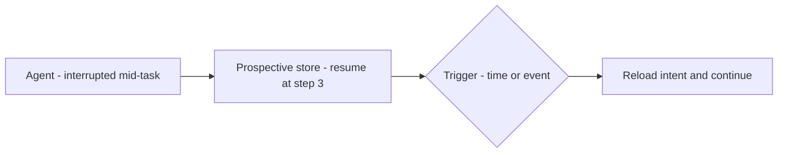

## Goal

Know the kinds of memory an [agent]() can have, what each
one *is*, and — most importantly — **when each one earns its place**. Memory is the most
over-engineered part of agent design: every type you add is state to store, retrieve, secure,
and keep fresh.

## Start from one fact

The model itself remembers nothing between calls — its only "memory" is whatever the harness
puts in the [context window]() this turn.
**Working memory** *is* that window; the other six types are strategies for persisting things
outside the model and loading them back in when relevant.

## The seven types

### 1. Working memory — the active context window

**What it is** — everything the model can "see" right now: the current messages, the system
prompt, tool outputs, and reasoning steps. **When you need it** — always; it's the baseline,
managed by the [harness]() (often with a *checkpointer*
keyed by a thread id so a conversation can resume). **Example** — ask *"what did I just say?"*
and it answers by looking back in the window. The engineering here is
[context management](): trim or summarize as
it fills, or the run breaks.

### 2. Semantic memory — knowledge that lasts

**What it is** — durable facts, preferences, and profiles about users or topics. **When you
need it** — users repeat themselves across sessions, or answers must be personalized and
consistent. **Where it lives** — a [vector DB]()
or profile store. **Example** — the agent stores *"user prefers metric units"* and applies it
in every future session without being told again.

### 3. Episodic memory — experiences that teach

**What it is** — a record of past events: full conversations, task outcomes, successes and
failures, with timestamps. **When you need it** — the agent repeats mistakes it already made,
or needs an audit trail. **Where it lives** — an event/log store, retrieved by similarity.
**Example** — **Reflexion**: the agent writes a self-reflection after each failed attempt,
stores it, and reuses it next time — reaching 91% on a coding benchmark versus GPT-4's 80%.
The lesson: episodic memory is how an agent gets *better* instead of restarting from zero.

### 4. Procedural memory — how to do things

**What it is** — knowledge of *how* tasks get done: skills, workflows, tool-use patterns, and
behavioral rules. **When you need it** — the agent re-derives the same procedure every run.
**Where it lives** — [skills](), tool schemas, prompt
templates, and scripts. **Example** — **Voyager** (a Minecraft agent) builds a library of
executable skills and, for new tasks, reuses and composes existing ones instead of solving
from scratch. Tools give an agent *capabilities*; procedural memory gives it *procedures*.

### 5. External memory — bring outside knowledge in

**What it is** — knowledge kept outside the model in a vector DB and fetched at inference by
similarity search. This *is* [RAG](). **When you need it** —
the knowledge is too large for the context window and changes often. **Example** — a support
agent embeds your docs, stores them, and retrieves the most relevant chunks when a user asks.

### 6. Parametric memory — baked into the weights

**What it is** — knowledge learned during training and stored directly in the model's weights:
language, reasoning patterns, world knowledge. **When you need it** — you don't *add* it at
runtime; it's always there, instant, no retrieval. **Trade-off** — fastest and cheapest, but
frozen at the training cutoff and hard to update or audit. **Example** — the model knows what
a REST API is without being told, but won't know a library released last month. Fill that gap
with external memory or [fine-tuning]() — never at
runtime.

### 7. Prospective memory — remember what to do next

**What it is** — future intentions and scheduled goals the agent has committed to but not yet
executed: pending tasks, goal stacks, reminders. **When you need it** — long-horizon agents
that must act on future events, not just the current turn. **Where it lives** — a task queue
or reminder log, fired by a time/event/agent trigger. **Example** — an agent finishes step 2
of 5, gets interrupted, and logs *"resume at step 3 with these inputs"*; when it restarts it
reads the intent and continues exactly where it left off.

## Symptom → memory

Work backwards from failure, not forwards from the taxonomy:

| Symptom | What's missing |
| ------ | ------ |
| Forgets instructions mid-task | Working memory management (trim/summarize), not more storage |
| Asks the user the same thing every session | Semantic |
| Repeats a mistake it made last week | Episodic |
| Solves a routine task differently (and worse) each time | Procedural |
| Doesn't know your documents | External (RAG) |
| Knowledge is outdated | Parametric limit — RAG or fine-tune, no runtime fix |
| Loses the thread of a long, interrupted job | Prospective |

## Example — a support agent's memory stack

Turn 1 of a session: the harness loads the ticket thread (working), the customer's plan and
language (semantic), a note that this customer's last issue was mis-escalated (episodic), the
refund runbook (procedural), and retrieves the relevant policy passages (external). Five
types, one context window — each loaded *because a past failure demanded it*, not because the
diagram had a box for it.

## Strengths & limitations

- **Strengths** — continuity across sessions is what separates an assistant from a stateless
  chatbot; episodic + procedural memory is how agents get *better* instead of starting from
  zero each run.
- **Limitations** — stored memories go stale and confidently wrong (a moved customer, a
  changed policy); retrieval can surface the *wrong* memory, which poisons the turn; personal
  facts raise privacy and retention duties (see
  [Responsible AI]()); every store is
  infrastructure to run and sync.

> Start with working memory only. Add one type at a time, when a real symptom appears — never
> all seven because a diagram showed seven.

## Sources

- Sumers et al., *Cognitive Architectures for Language Agents (CoALA)* (2023) — [arXiv:2309.02427](https://arxiv.org/abs/2309.02427)
- Packer et al., *MemGPT: Towards LLMs as Operating Systems* (2023) — [arXiv:2310.08560](https://arxiv.org/abs/2310.08560)
- Shinn et al., *Reflexion: Language Agents with Verbal Reinforcement Learning* (2023) — [arXiv:2303.11366](https://arxiv.org/abs/2303.11366)
- Wang et al., *Voyager: An Open-Ended Embodied Agent with Large Language Models* (2023) — [arXiv:2305.16291](https://arxiv.org/abs/2305.16291)
- [Anthropic — Effective context engineering for AI agents](https://www.anthropic.com/engineering/effective-context-engineering-for-ai-agents)
