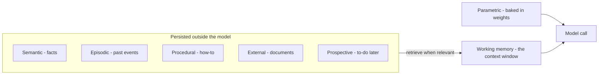

## Goal

Know the kinds of memory an [agent]() can
have, what each one *is*, and — most importantly — **when each one earns its place**. Memory
is the most over-engineered part of agent design: every type you add is state to store,
retrieve, secure, and keep fresh. Each type has its own page; this is the map.

## Start from one fact

The model itself remembers nothing between calls — its only "memory" is whatever the harness
puts in the [context window]()
this turn. **Working memory** *is* that window; the other six types are strategies for
persisting things outside the model and loading them back in when relevant.

## The seven types

| Type | In one line | Add it when… |
| ------ | ------ | ------ |
| [Working]() | The active context window | Always — the baseline |
| [Semantic]() | Durable facts and preferences | Users repeat themselves across sessions |
| [Episodic]() | Past events and outcomes | The agent repeats old mistakes |
| [Procedural]() | How to do tasks | It re-derives the same procedure every run |
| [External]() | Documents in a vector DB (RAG) | Knowledge is large and changes often |
| [Parametric]() | Knowledge baked into the weights | Never at runtime — it's always there |
| [Prospective]() | Things to do later | Long-horizon jobs that resume after interruption |

## Symptom → memory

Work backwards from failure, not forwards from the taxonomy:

| Symptom | What's missing |
| ------ | ------ |
| Forgets instructions mid-task | Working memory management (trim/summarize), not more storage |
| Asks the user the same thing every session | Semantic |
| Repeats a mistake it made last week | Episodic |
| Solves a routine task differently (and worse) each time | Procedural |
| Doesn't know your documents | External (RAG) |
| Knowledge is outdated | Parametric limit — RAG or fine-tune, no runtime fix |
| Loses the thread of a long, interrupted job | Prospective |

## Example — a support agent's memory stack

Turn 1 of a session: the harness loads the ticket thread (working), the customer's plan and
language (semantic), a note that this customer's last issue was mis-escalated (episodic), the
refund runbook (procedural), and retrieves the relevant policy passages (external). Five
types, one context window — each loaded *because a past failure demanded it*, not because the
diagram had a box for it.

## Strengths & limitations

- **Strengths** — continuity across sessions is what separates an assistant from a stateless
  chatbot; episodic + procedural memory is how agents get *better* instead of starting from
  zero each run.
- **Limitations** — stored memories go stale and confidently wrong (a moved customer, a
  changed policy); retrieval can surface the *wrong* memory, which poisons the turn; personal
  facts raise privacy and retention duties (see
  [Responsible AI]()); every
  store is infrastructure to run and sync.

> Start with working memory only. Add one type at a time, when a real symptom appears — never
> all seven because a diagram showed seven.

## Sources

- Sumers et al., *Cognitive Architectures for Language Agents (CoALA)* (2023) — [arXiv:2309.02427](https://arxiv.org/abs/2309.02427)
- Packer et al., *MemGPT: Towards LLMs as Operating Systems* (2023) — [arXiv:2310.08560](https://arxiv.org/abs/2310.08560)
- [Anthropic — Effective context engineering for AI agents](https://www.anthropic.com/engineering/effective-context-engineering-for-ai-agents)
