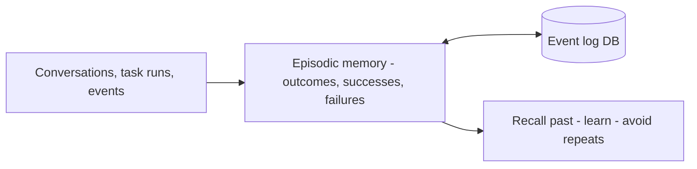

*Experiences that teach.*

## What it is

A record of past events: full conversations, task outcomes, successes and failures, with
timestamps. It's how an agent learns from its own history instead of restarting from zero.

## When you need it

The agent repeats mistakes it already made, or you need an audit trail of what happened and
why.

## Where it lives

An event/log store, retrieved by similarity to the current situation.

## Example

**Reflexion**: the agent writes a self-reflection after each failed attempt, stores it, and
reuses it next time — reaching 91% on a coding benchmark versus GPT-4's 80%. Episodic memory
is how an agent gets *better* run over run.

## Sources

- Shinn et al., *Reflexion: Language Agents with Verbal Reinforcement Learning* (2023) — [arXiv:2303.11366](https://arxiv.org/abs/2303.11366)
