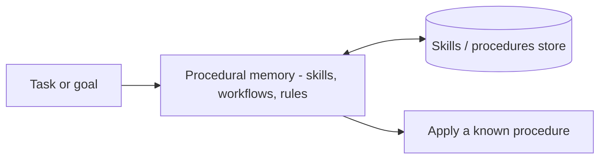

*Knowledge of how to do things.*

## What it is

Knowledge of *how* tasks get done: skills, workflows, tool-use patterns, and behavioral rules.
Tools give an agent *capabilities*; procedural memory gives it *procedures*.

## When you need it

The agent re-derives the same procedure on every run instead of reusing a known-good one.

## Where it lives

[Skills](), tool schemas, prompt templates, and
scripts — a library the agent draws on.

## Example

**Voyager** (a Minecraft agent) builds a library of executable skills and, for new tasks,
reuses and composes existing ones instead of solving from scratch.

## Sources

- Wang et al., *Voyager: An Open-Ended Embodied Agent with Large Language Models* (2023) — [arXiv:2305.16291](https://arxiv.org/abs/2305.16291)
