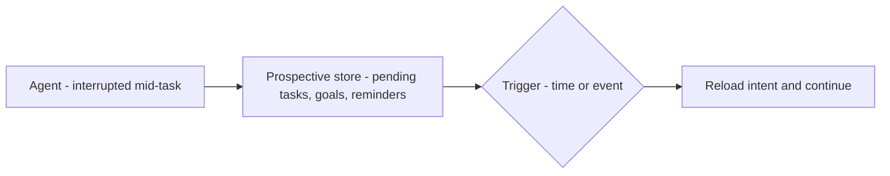

*Remember what you plan to do next.*

## What it is

Future intentions and scheduled goals the agent has committed to but not yet executed:
pending tasks, goal stacks, reminders. It's how a long-horizon agent survives interruptions.

## When you need it

Long-horizon agents that must act on future events — not just respond to the current turn —
and jobs that span interruptions or restarts.

## Where it lives

A task queue, goal stack, or reminder log, fired by a time / event / agent trigger.

## Example

An agent finishes step 2 of 5, gets interrupted, and logs *"resume at step 3 with these
inputs."* When it restarts it reads the intent and continues exactly where it left off,
instead of losing the thread.

## Related

- [Loop engineering]() — long-running loops that lean on prospective state.
- [The agent harness]() — where stop/resume conditions live.
