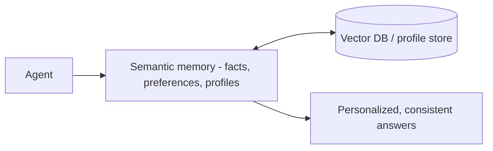

*Knowledge that lasts.*

## What it is

A persistent store of facts, preferences, and profiles about users or topics — the things
that should survive across sessions and be applied consistently.

## When you need it

Users repeat themselves across sessions, or answers must be personalized and consistent —
without the user re-stating the same context every time.

## Where it lives

A [vector DB]() or a structured profile store,
written when a durable fact appears and retrieved when relevant to the current turn.

## Example

The agent stores *"user prefers metric units"* once and applies it in every future session —
the user never has to say it again.

## Related

- [Vector databases]() — where durable facts are stored and searched.
- Distinct from [external memory](): semantic is *learned about the user*, external is *your documents*.
