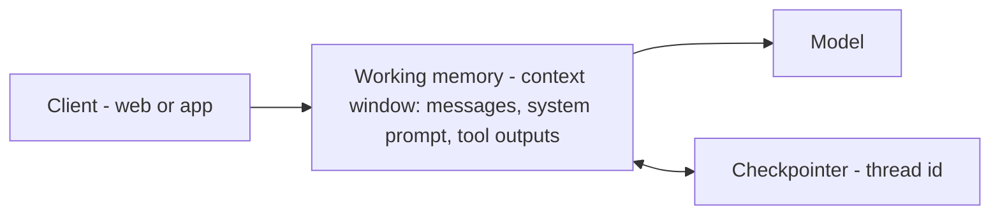

*The active context window.*

## What it is

Everything the model can "see" this turn: the current messages, the system prompt, tool
outputs, and reasoning steps. It's the agent's scratchpad — and the only memory the model
truly has, since the model is stateless between calls.

## When you need it

Always — it's the baseline every agent runs on, managed by the
[harness](). A *checkpointer* keyed by a thread id
lets a conversation pause and resume.

## Where it lives

In the [context window]() itself — nothing is persisted
elsewhere. The engineering is context management: as it fills, you **trim or summarize** old
turns, or the run breaks.

## Example

Ask *"what did I just say?"* and the agent answers by looking back in the window — no store,
no retrieval, just what's in context right now.

## Related

- [Context engineering]() — how to keep the window lean.
- [The agent harness]() — what manages the loop and the checkpointer.
