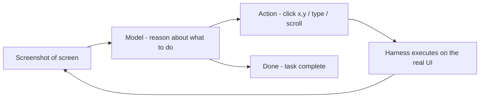

## Goal

Most of this vault is about agents that read and write *text*. This page is about agents that
**act in the world**: control a computer's screen, hold a voice conversation, or drive a
device. The model is the same; what changes is the *interface* between it and reality.

## Computer use — the loop

**Computer use** lets an agent operate a GUI the way a person does: it's given a **screenshot**,
decides an action (*click here, type this, scroll*), the harness **executes** it on the real
screen, and the agent sees the *next* screenshot. It's the [agent
loop](), but the tool is a mouse and keyboard.

Example: *"book the cheapest flight to Hanoi next Friday."* The agent screenshots the browser,
clicks the search box, types the route, reads the results, picks the cheapest, and fills the
form — each step chosen from what it just saw. It works with **any** software, including apps
with no API, because it uses the same interface a human does.

## Real-time and embodied variants

- **Voice / real-time** — the same reasoning, but latency is the constraint. Speech-to-text in,
  the model reasons, text-to-speech out — fast enough to feel like conversation. Used for phone
  agents and live assistants.
- **Robotics / embodiment** — the "screen" becomes sensors and the "click" becomes a motor
  command. Far harder (the physical world is unforgiving), but the loop is the same:
  perceive → reason → act → perceive.

## How this differs from multimodality

[Multimodality]() is about *input* — the
model can *see* an image or *hear* audio. Computer use is about *action* — the model *does*
something in a live environment and reacts to the consequence. Multimodality is a prerequisite
(the agent must see the screen to act on it), but acting in a loop is the new part.

## Strengths & limitations

- **Strengths** — works with software that has no API (legacy apps, any website); automates
  end-to-end human workflows; the same skill generalizes across tools.
- **Limitations** — **slow and brittle** (a moved button breaks it; each step is a full model
  call on an image); and the biggest one — **it can take real, hard-to-undo actions**, so it's
  a serious [security]() and
  [oversight]() surface. Sandbox
  it, gate irreversible actions behind approval, and never point it at a system where a wrong
  click is catastrophic.

## Sources

- [Anthropic — Introducing computer use](https://www.anthropic.com/news/3-5-models-and-computer-use)
- [Anthropic — Computer use (docs)](https://docs.claude.com/en/docs/build-with-claude/computer-use)
