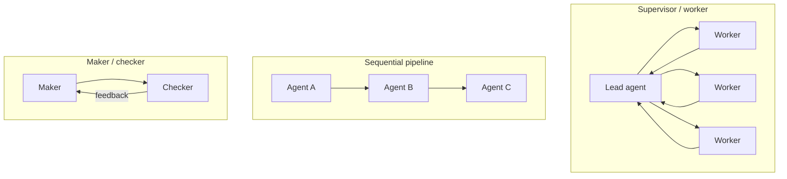
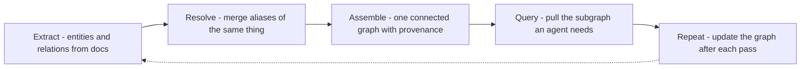

## Goal

Understand when several agents beat one, how they coordinate, and the hard problem that shows
up the moment they run for a long time: **agents have no long-term memory**. The answer this
page builds toward is a *shared knowledge graph* — a memory the whole team reads and writes.

## Single vs. multi-agent

Start from the vault's default: the *fewest* moving parts that solve the task. A single
[agent]() with good tools handles most work,
and it's cheaper and easier to debug. Reach for multiple agents only when:

- The task **splits into independent sub-tasks** that can run in parallel (research five
  topics at once).
- It needs **distinct roles** that shouldn't share one context (a maker and an independent
  checker, or a planner and specialized workers).
- One agent's context window can't hold the whole job.

Multi-agent is not free: every agent is more model calls, more coordination, and more ways to
fail. Most "we need multi-agent" problems are really one agent that needs better tools.

## Topologies

- **Supervisor / worker** — a lead agent decomposes the goal, delegates to workers, and
  synthesizes their results. Anthropic's research system uses this: a lead researcher plans
  and spawns subagents for each part. Best when sub-tasks parallelize.
- **Sequential pipeline** — each agent transforms and passes to the next (extract → analyze →
  write). Best when stages are ordered and distinct.
- **Maker / checker** — one agent produces, another independently verifies. The
  [loop-engineering]() validator pattern, split
  across two agents so the checker isn't grading its own work.

## The hard problem — a team with no memory

An [agent has no long-term memory](): everything it
knows lives in the [context window]().
When a conversation ends or overflows the window, that "memory" is gone. For a *single* agent
you manage this with the memory types (semantic, episodic, …). But with *many* agents running
for hours or days, each one is a **new employee every session** — and they can't share what
they learned. Passing full transcripts between agents doesn't scale and loses provenance.

## Knowledge graph as shared memory

The fix: instead of each agent remembering privately, **all agents read and write one shared
knowledge graph** — nodes are entities, edges are relationships, and every fact carries its
source. Knowledge becomes persistent, traceable, and reusable across agents and sessions.
Anthropic's pipeline for building and using it has five stages:

- **Extract** — pull entities and subject–predicate–object triples from each document (a cheap
  model, one call per doc, guided by a schema).
- **Resolve** — merge different names for the same thing (*"Edwin Aldrin"* → *"Buzz Aldrin"*)
  using meaning, not string overlap — a stronger model reasons over descriptions.
- **Assemble** — build canonical nodes and typed edges into one connected graph, with
  **provenance** on every triple (which document it came from).
- **Query** — pull just the subgraph an agent needs to reason, so every answer can cite a
  specific edge.
- **Repeat** — write new facts back after each pass, so the graph grows instead of resetting.

With this shared memory, workers write findings to the graph, a checker fact-checks against
it, and a long-running job can **resume overnight** instead of starting over. The team stops
being a set of strangers and starts working on the company's shared knowledge.

## Two different "graphs" — don't conflate them

The word *graph* is overloaded here:

- **Knowledge graph** (this page) — a *data* structure: nodes = entities, edges = relations.
  It's shared **memory**.
- **Execution graph** ([graph engineering]())
  — a *control-flow* structure: nodes = agents/steps, edges = what runs next. It's the
  **wiring**.

A multi-agent system often uses both: an execution graph routes the work, a knowledge graph
remembers it.

## Strengths & limitations

- **Strengths** — parallelism and specialized roles tackle work one agent can't; a shared
  knowledge graph gives durable, **citable** memory across agents and sessions, and makes
  fact-checking and resumption possible.
- **Limitations** — coordination multiplies cost, latency, and failure modes; a knowledge
  graph is a real pipeline to build and maintain (extraction and entity resolution are
  imperfect and can poison the graph) — heavier than a [vector DB](),
  so use it when relationships and provenance matter, not for plain lookup. Start with one
  agent; add agents, then shared graph memory, only when a real symptom demands it.

## Sources

- [Anthropic — How we built our multi-agent research system](https://www.anthropic.com/engineering/built-multi-agent-research-system)
- Edge et al., *From Local to Global: A Graph RAG Approach to Query-Focused Summarization* (2024) — [arXiv:2404.16130](https://arxiv.org/abs/2404.16130)
- Wang et al., *MIRIX: Multi-Agent Memory System for LLM-Based Agents* (2025) — [arXiv:2507.07957](https://arxiv.org/abs/2507.07957)
- Hong et al., *MetaGPT: Meta Programming for Multi-Agent Collaborative Framework* (2023) — [arXiv:2308.00352](https://arxiv.org/abs/2308.00352)
