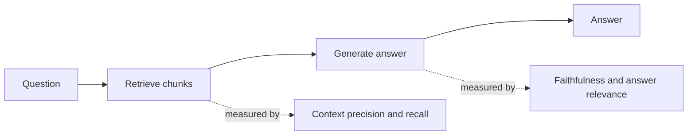

*Why "the answer was wrong" is never a useful bug report for a RAG system.*

## Goal

Find out *which half* of a [RAG]() pipeline is failing. A single
end-to-end score tells you the system is bad; it never tells you whether to fix chunking, the
retriever, or the prompt. This page is the RAG-specific companion to
[Evaluation in practice]().

## Split the pipeline first

RAG has two independently breakable halves, and they fail in ways that look identical from the
outside:

| The failure | What it looks like | Where to fix it |
| ------ | ------ | ------ |
| The right chunk was never retrieved | Confident, fluent, wrong | Chunking, embeddings, hybrid search, re-ranking |
| The right chunk was retrieved and ignored | Answer contradicts a source it was given | Prompt, context ordering, model choice |
| The right chunk was retrieved and buried | Answer is vague or partial | Top-K, re-ranking, context length |

**Measure retrieval before you touch generation.** Retrieval quality caps answer quality — no
prompt fixes a context that never contained the answer, and most teams spend weeks on prompts
for what was a chunking bug.

## The four metrics

These are the RAGAS metrics, and each one deliberately looks at a different triple of
*question*, *context*, and *answer*:

| Metric | Question it asks | Inputs | Fix when it is low |
| ------ | ------ | ------ | ------ |
| **Context recall** | Did we retrieve everything needed to answer? | question, context, ground truth | Chunk size, embedding model, top-K, hybrid search |
| **Context precision** | Are the retrieved chunks actually relevant, and ranked well? | question, context | Re-ranking, metadata filters, lower top-K |
| **Faithfulness** | Is every claim in the answer supported by the context? | context, answer | Prompt, model, context ordering |
| **Answer relevance** | Does the answer actually address the question? | question, answer | Prompt, query understanding |

Two pairs, and the pairs behave differently. **Recall and precision trade off**: raising top-K
lifts recall and drops precision, and the sweet spot is workload-specific. **Faithfulness and
answer relevance are nearly independent**: an answer can be perfectly grounded and useless
("the document does not specify"), or fluent, on-topic, and entirely invented.

Faithfulness is the one to watch. It is the direct measurement of
[hallucination]() in a grounded system, and it is the metric a
casual eye-test misses most often, because an ungrounded claim reads exactly like a grounded
one.

## Building the golden set

The metrics are worthless without data that reflects your corpus.

- **Start from real queries.** Pull them from logs. Invented questions are cleaner, easier, and
  systematically unlike what users actually ask.
- **Annotate the source, not just the answer.** For each question record *which chunk or
  document should be retrieved*. This is what makes context recall computable, and it is the
  annotation teams skip and later regret.
- **Cover the shapes, not just the topics.** Include multi-hop questions, questions whose
  answer is not in the corpus (the correct answer is "I don't know" — and a system that
  invents one here is the most dangerous failure), near-duplicate documents, and questions
  answerable only from a table or image.
- **Synthetic generation is a starting point.** Having a model generate question–answer pairs
  from your documents bootstraps coverage quickly, but it inherits a bias toward questions that
  are easy to answer from a single chunk. Review a sample by hand.
- **100–200 well-chosen examples beat 10,000 generated ones.** The set has to be small enough
  that someone actually reads the failures.

## RAGAS vs a plain LLM judge

RAGAS is a library of these reference metrics, mostly implemented as LLM-as-judge prompts with
a defined decomposition — faithfulness, for example, splits the answer into atomic claims and
checks each against the context, rather than asking "is this grounded?" in one shot.

| | Use RAGAS | Use your own judge |
| ------ | ------ | ------ |
| **Why** | Standard, comparable, no prompt design needed | Your rubric, your domain, your definition of correct |
| **Best for** | Getting a baseline in an afternoon; tracking the four standard axes | Domain criteria RAGAS has no metric for — citation format, regulatory tone, required disclaimers |

They are not exclusive, and the usual answer is both: RAGAS for the four standard axes,
a custom judge for what your product specifically demands.

Either way, **validate the judge before you trust it**. Hand-label 30–50 examples, check the
judge agrees, and only then start making decisions from its scores. An unvalidated judge
produces a number that moves — which is worse than no number, because it looks like evidence.

## Wire it into CI

The metrics only pay off as a gate. Run the golden set on every change to chunking, the
embedding model, top-K, the retriever, the prompt, or the model version — and pin the model
version, because a provider update is itself a change to evaluate. Fail the build when
faithfulness or context recall drops past a threshold, and break the report down by question
category so one aggregate score cannot hide a collapse on a slice that matters.

## Strengths & limitations

- **Strengths** — localises a failure to retrieval or generation in one run; faithfulness gives
  a concrete, trackable hallucination number; most of it needs no human-written ground truth,
  so it runs cheaply in CI on every change.
- **Limitations** — LLM-judge metrics are noisy and drift when the judge model changes, so pin
  it; context recall needs annotated ground truth, which is the expensive part; the scores are
  relative, not absolute, and chasing 1.0 is a waste; and none of these metrics capture latency,
  cost, or tone, which users notice just as fast as correctness.

## Where to go next

- The general eval machinery → [Evaluation in practice]().
- Fix low context recall → [Advanced RAG]().
- Let the system grade and retry itself → [Self-correcting RAG]().
- Watch these metrics in production → [Observability]().

## Sources

- Es et al., *RAGAS: Automated Evaluation of Retrieval Augmented Generation* (2023) — [arXiv:2309.15217](https://arxiv.org/abs/2309.15217)
- Saad-Falcon et al., *ARES: An Automated Evaluation Framework for Retrieval-Augmented Generation Systems* (2023) — [arXiv:2311.09476](https://arxiv.org/abs/2311.09476)
- Chen et al., *Benchmarking Large Language Models in Retrieval-Augmented Generation* (2023) — [arXiv:2309.01431](https://arxiv.org/abs/2309.01431)
- [RAGAS documentation — metrics](https://docs.ragas.io/en/stable/concepts/metrics/)
