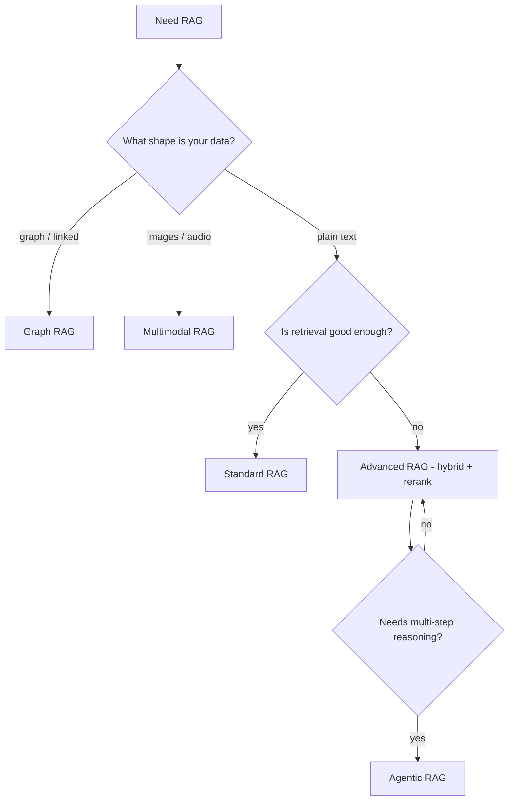

"RAG" has grown into a family of variants. The confusion is that some are distinct
**architectures** while others are just **techniques** used inside one. This page separates them.

## The family

| Type | What's different | When to use |
| ------ | ------------------ | ------------- |
| **Standard (naive) RAG** | Fixed pipeline: retrieve top-k → augment → generate | Simple Q&A over documents |
| **Advanced RAG** | Better retrieval: hybrid search, re-ranking, query transforms | When naive retrieval misses |
| **Agentic RAG** | An agent decides *when* and *what* to retrieve, and can iterate | Complex, multi-step questions |
| **Graph RAG** | Retrieves over a knowledge graph (entities + relationships) | Connected / multi-hop questions |
| **Multimodal RAG** | Retrieves images, tables, audio — not just text | Mixed-media sources |

## Architectures vs. techniques

This is the distinction that clears up the confusion:

- **Architectures** (the rows above) change the *shape* of the system.
- **Techniques** improve one step inside an architecture — they are **not** separate RAG types:
  - **Hybrid search** (dense + keyword), **re-ranking**, and **query transforms** live inside
    [Advanced RAG]().
  - **CRAG** (corrective RAG) and **Self-RAG** add a self-check step ("is the retrieved context
    good enough?") — refinements, not a new architecture.

So "we use hybrid search" and "we use agentic RAG" aren't the same kind of statement: the first
is a technique, the second is an architecture.

## Which one?

## Where to go next

- Improve retrieval → [Advanced RAG]().
- Build the standard pipeline → [Building a RAG system]().
- Agent-driven retrieval → Agentic RAG (Stage 2, coming soon).

Start simple. Move to advanced when retrieval is the bottleneck, and to agentic only when the
question genuinely needs multi-step reasoning.
