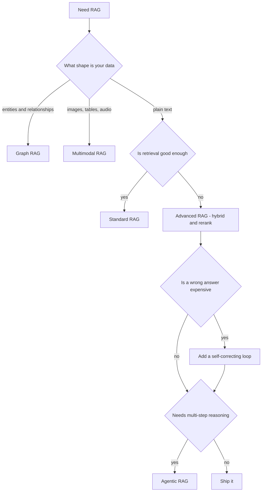

## Goal

Work out which "RAG" someone means, and pick the right one for your data, your accuracy bar,
and your budget. "RAG" has grown into a family, and its members are not all the same *kind* of
thing. This section separates them.

## The family

| Variant | What is different | Read more |
| ------ | ------ | ------ |
| **Standard (naive) RAG** | Fixed pipeline: retrieve top-k, augment, generate | [RAG]() |
| **Advanced RAG** | Same shape, better retrieval: hybrid search, re-ranking, query transforms | [Advanced RAG]() |
| **Self-correcting RAG** | Grades the retrieval or the answer, and retries | [This section]() |
| **Graph RAG** | Retrieves entities and relationships, not isolated chunks | [This section]() |
| **Multimodal RAG** | Retrieves images, tables, audio | [This section]() |
| **Agentic RAG** | An agent decides *when* and *what* to retrieve, and iterates | [Agentic RAG]() |

## Architecture, loop, or technique

This is the distinction that clears up the confusion. The family above holds three different
kinds of thing:

| Kind | What it changes | Members |
| ------ | ------ | ------ |
| **Architecture** | the *shape*: what you retrieve from | Standard, Graph, Multimodal, Agentic |
| **Control loop** | the *flow*: retrieve once, or grade and retry | CRAG, Self-RAG |
| **Technique** | one *step* inside any of the above | hybrid search, re-ranking, query transforms |

So "we use hybrid search" and "we use agentic RAG" are not the same kind of statement. The
first names a step, the second names a shape.

Lists of "six RAG architectures" usually mix all three kinds together, which is why no two of
them agree. Hybrid search is the clearest case: it is a retrieval step, and it belongs inside
[Advanced RAG](), not beside it.

## In this section

The three variants nothing else in the vault owns get their own page:

| Page | In one line | Reach for it when… |
| ------ | ------ | ------ |
| [Graph RAG]() | Index entities and relationships, retrieve a connected subgraph | The answer needs two or three linked facts |
| [Multimodal RAG]() | Retrieve images, tables, and audio, not only prose | The meaning lives in the media |
| [Self-correcting RAG]() | CRAG and Self-RAG grade the work and retry | A wrong answer costs more than a slow one |

## Choosing one

Ratings are relative to standard RAG on the same corpus. They are qualitative on purpose:
your numbers depend on your data.

| Variant | Accuracy gain | Added latency | Added cost | Complexity | Worth it when |
| ------ | ------ | ------ | ------ | ------ | ------ |
| **Standard** | baseline | baseline | baseline | low | Plain text, direct lookups |
| **Advanced** | medium | small, one re-rank pass | small | low to medium | Retrieval is the bottleneck, which it usually is |
| **Self-correcting** | high on accuracy-critical queries | high, an extra model call and sometimes a second retrieval | high | medium | A wrong answer is expensive |
| **Graph** | high on multi-hop and corpus-wide questions | medium at query time | high at ingest, a model pass over the whole corpus | high | The value is in the relationships |
| **Multimodal** | high when the answer is in the media | small at query time | medium at ingest, one call per media item | medium | Sources are not prose |
| **Agentic** | high on multi-step questions | highest, several loops per question | highest | high | The question genuinely needs several steps |

There is no best architecture. Read the row that matches **your failure**, not the row with
the highest accuracy.

## Which one?

## Where to go next

- Improve retrieval → [Advanced RAG]().
- Build the standard pipeline → [Building a RAG system]().
- Agent-driven retrieval → [Agentic RAG]().

Start simple. Move to advanced when retrieval is the bottleneck, add a loop when a wrong
answer is expensive, and go agentic only when the question genuinely needs multi-step
reasoning.

## Sources

- Lewis et al., *Retrieval-Augmented Generation for Knowledge-Intensive NLP Tasks* (2020) — [arXiv:2005.11401](https://arxiv.org/abs/2005.11401)
- Asai et al., *Self-RAG* (2023) — [arXiv:2310.11511](https://arxiv.org/abs/2310.11511)
- Yan et al., *Corrective RAG (CRAG)* (2024) — [arXiv:2401.15884](https://arxiv.org/abs/2401.15884)
- Edge et al., *From Local to Global: A Graph RAG Approach* (2024) — [arXiv:2404.16130](https://arxiv.org/abs/2404.16130)
