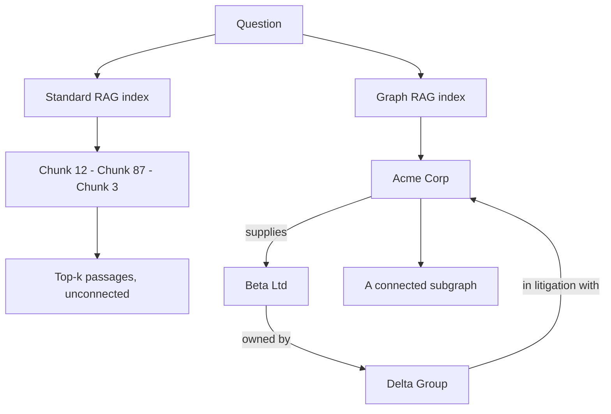

*Retrieve the connections, not just the passages.*

## What it is

Standard RAG stores documents as isolated chunks. Each chunk is retrieved on its own
similarity to the question, and nothing in the index records that chunk 12 and chunk 87 are
about the same company. Graph RAG indexes **entities and the relationships between them**,
then retrieves a connected subgraph instead of a ranked list.

## How it works

Three things happen at ingest time, not at query time:

1. **Extract.** A model reads each chunk and pulls out entities and the relations between
   them.
2. **Resolve.** Duplicates are merged, so "Acme", "Acme Corp." and "ACME" become one node.
3. **Store.** The result is written as a graph of nodes and edges.

At query time the system finds entry-point nodes for the question, then walks the edges to
collect connected facts. Microsoft's GraphRAG adds one more step: it clusters the graph into
communities and pre-writes a summary of each, so a broad question can be answered from
summaries rather than from raw chunks.

The same structure is used elsewhere in this vault for a different job. See
[Multi-agent systems]() for the knowledge graph as
*shared memory between agents*. Here it is a *retrieval index*. The extract and
resolve steps are the same; that page adds the steps an agent team needs on top.

## When to use it

- **Multi-hop questions**, where the answer needs two or three linked facts.
- **"What connects X and Y"** questions, which similarity search cannot express.
- **Corpus-wide questions**, such as "what are the recurring themes across all incident
  reports", where no single chunk holds the answer.

Do not use it for direct lookups. If the question is "what is our refund window", a chunk
already contains the answer and the graph earns nothing.

## Example

Ask a supplier assistant: *"Which of our suppliers are owned by a company we are in
litigation with?"*

Standard RAG retrieves the supplier list and the litigation memo as two separate chunks. The
model has no way to join them, so it either guesses or says it cannot tell. Graph RAG walks
`supplies` to `owned by` to `in litigation with` and returns the path, so the answer names
the supplier and shows why.

## The cost

Building the graph means running a model over the whole corpus at ingest, plus an entity
resolution pass. Documents that change need re-ingesting. That is far more expensive than
embedding chunks, and it is the reason to reach for Graph RAG only when the value really is
in the relationships.

## Sources

- Edge et al., *From Local to Global: A Graph RAG Approach to Query-Focused Summarization* (2024) — [arXiv:2404.16130](https://arxiv.org/abs/2404.16130)
