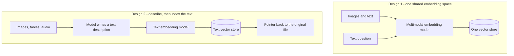

*When the answer is in a diagram, not a paragraph.*

## What it is

Retrieval where the source material is not prose: wiring diagrams, scanned invoices, chart
images, slide decks, call recordings. A text-only index can find the page that *mentions* the
thing, but not the thing itself.

This is about **retrieval**. For the model's ability to read images and audio as input, see
[Multimodality]().

## Two designs

## How it works

**Design 1** embeds pictures and words into the same vector space, so a text question
retrieves an image directly. This is the CLIP idea. It is elegant, and it needs a multimodal
embedding model that handles your domain well.

**Design 2** runs a vision model over each image or table at ingest, writes a text
description, and indexes that description. Keep a pointer to the original file so the answer
can show it.

Design 2 is usually the better starting point. The retrieval stack stays the text stack you
already run, the descriptions are searchable and auditable, and a wrong description is
something a human can read and fix. Parsing and OCR at ingest belong to the pipeline in
[Building a RAG system]().

## When to use it

When the meaning lives in the media. If your images are decorative and every fact is also in
the prose, index the prose and stop.

## Example

An equipment support assistant. The fix for error code `E-14` is printed in a wiring diagram,
and the manual text only says "see figure 4".

A text-only index retrieves the sentence with `E-14` in it, and the assistant answers "see
figure 4", which helps nobody. With design 2 the diagram was described at ingest, so the
retrieved context includes "figure 4 shows relay K3 between the controller and the pump". The
answer now names the part, and attaches the original image.

## The cost

Describing media is one model call per item at ingest, and descriptions can be wrong in ways
that are hard to notice. Spot-check the descriptions for your highest-value documents rather
than trusting the whole corpus.

## Sources

- Radford et al., *Learning Transferable Visual Models From Natural Language Supervision* (2021) — [arXiv:2103.00020](https://arxiv.org/abs/2103.00020)
