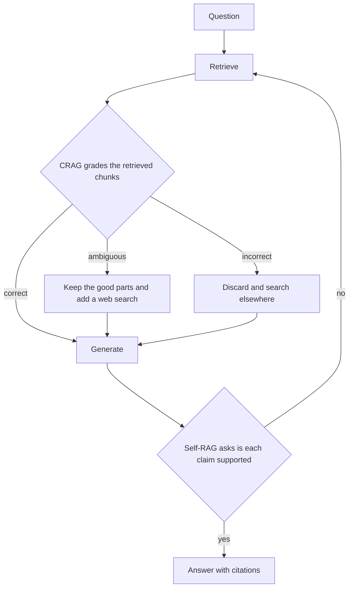

*Check the retrieval before you trust it.*

## What it is

Standard RAG retrieves once and answers, whatever came back. A self-correcting design adds a
**grading step** and a way to retry. Two named designs do this, and they grade different
things:

- **CRAG** grades the retrieved chunks, **before** generating.
- **Self-RAG** grades its own draft answer, **after** generating, and can skip retrieval
  entirely when the question does not need it.

That diagram simplifies both papers in one way each. In CRAG the refine pass also runs on the
*correct* branch, not only on ambiguous. And the Self-RAG retry edge is how agent frameworks
commonly implement it; in the paper the model generates from several retrieved passages in
parallel, and the reflection tokens pick the best-supported one.

## How they differ

| | CRAG | Self-RAG |
| ------ | ------ | ------ |
| What it grades | the retrieved chunks | its own draft answer |
| When | before generating | after generating |
| Who decides | a small retrieval evaluator model | the generator itself, using reflection tokens it was trained to emit |
| Fallback when the grade is bad | refine the chunks, or search the web instead | retrieve again, or decline to answer |
| Always retrieves | yes | no, it first decides whether retrieval is needed |
| Extra cost per query | one evaluator call | one or more extra generation passes |

## When to use it

When a wrong answer costs more than a slow answer. Regulated advice, medical or legal
summaries, and anything a customer will act on without checking.

It is not free, and it is not a substitute for fixing retrieval. If the grader keeps returning
"incorrect", the problem is upstream. Fix chunking and hybrid search first, in
[Advanced RAG](), and add the loop on top of
retrieval that already works.

## Example

An internal policy assistant is asked: *"Can a contractor expense a business-class flight?"*

Retrieval returns the travel policy, which is written for employees, and nothing about
contractors. Standard RAG answers from the employee policy and is confidently wrong.

- **CRAG** grades that context as ambiguous. It keeps the general travel section, drops the
  employee-only clauses, and runs a second search scoped to contractor agreements.
- **Self-RAG** drafts the answer first, finds that the claim "contractors may book business
  class" has no supporting passage, and retrieves again before answering. If the second pass
  finds nothing, it says the policy does not cover this case.

Both reach the same place. CRAG gets there by doubting the input, Self-RAG by doubting itself.

## The cost

Every graded query costs at least one extra model call, and the loop can run more than once.
Latency roughly doubles in the bad case. A common compromise is to run the loop only on
queries a confidence score already flagged, rather than on all traffic. See the confidence
scoring and escalation stage in
[Building a RAG system]().

## Sources

- Asai et al., *Self-RAG: Learning to Retrieve, Generate, and Critique through Self-Reflection* (2023) — [arXiv:2310.11511](https://arxiv.org/abs/2310.11511)
- Yan et al., *Corrective Retrieval Augmented Generation* (2024) — [arXiv:2401.15884](https://arxiv.org/abs/2401.15884)
