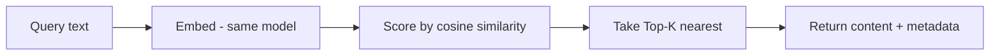
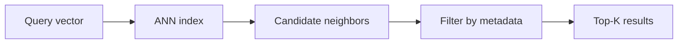

## Goal

Understand what happens inside the "vector store" box of every
[RAG]() diagram — from what a single record holds, to how a
query finds its nearest matches, to how that stays fast across millions of
[embeddings](), and which store to pick.

## What's in a record

An [embedding]() turns text into a vector — a list of
numbers that captures meaning. A vector database stores one **record** per chunk:

| Field | Example | Used for |
| ------ | ------ | ------ |
| `id` | `doc42#chunk3` | reference, updates, dedup |
| `vector` | `[0.021, -0.184, …]` (e.g. 384–1536 dims) | similarity search |
| `metadata` | `{source, lang, date, plan}` | filtering + citations |
| `content` | the original text | returned to the model as context |

The vector is what you *search by*; the metadata and content are what you *filter and return*.
Keeping the source in metadata is what lets RAG cite where an answer came from.

## How similarity search works

"Similar meaning → nearby vectors" needs a definition of *nearby*. Three distance metrics do
the job:

- **Cosine similarity** — the angle between vectors; ignores length. The default for text
  embeddings, and what most models are trained for.
- **Dot product** — like cosine but sensitive to magnitude; used when vectors are normalized
  (then it equals cosine) or when magnitude carries signal.
- **Euclidean (L2)** — straight-line distance; common for image and spatial vectors.

Use the **same metric your embedding model was trained with** — usually cosine for text.

A query then does **Top-K retrieval**: embed the query with the *same model*, score it against
stored vectors, return the **K closest** (K ≈ 3–10 for RAG). K is a dial — too small starves
the model of context, too large floods it with weak matches.

## Why it stays fast — ANN

Scoring the query against *every* stored vector (exact / brute-force search) is fine for 10k
vectors, hopeless for 100M at query time. Vector databases trade a little recall for a lot of
speed with **ANN (approximate nearest neighbor)** indexes: they return *almost certainly* the
closest matches, orders of magnitude faster.

## The three index ideas

| Index | Intuition | Trade-off |
| ------ | ------ | ------ |
| **HNSW** — hierarchical graph | A highway network: coarse links get you to the right region fast, local links find the exact neighbors | Best recall/speed for most workloads; index lives in RAM |
| **IVF** — inverted file / partitions | Cluster vectors into buckets; search only the few buckets nearest the query | Less memory, fast to build; recall drops if the right bucket is missed |
| **PQ** — product quantization | Compress vectors into short codes; compare codes instead of full vectors | 10–100× memory savings; some precision lost — often combined with IVF |

You rarely implement these — but the knobs you *will* tune (HNSW's `efSearch`, IVF's
`nprobe`) are all the same dial: **check more candidates → better recall, more latency**.

## Metadata filtering

Real queries are rarely pure similarity: *"passages like this query — but only from the
2026 handbook, in English, for the Pro plan."* The store filters on the metadata fields during
(not after) the search. Filtering *after* the search silently starves results: the top-K may
all fail the filter, leaving you with nothing.

## In a RAG pipeline

The vector database is the retrieval half of [RAG]():

- **Offline** — chunk documents, embed each chunk, store `id + vector + metadata + content`.
- **Online** — embed the question, Top-K search (with metadata filters), hand the returned
  content to the model as grounded context, cite from the metadata.

Retrieval quality caps answer quality — see [Advanced RAG]()
for chunking, hybrid search, and re-ranking on top of this.

## Choosing a store

| Situation | Reach for |
| ------ | ------ |
| You already run Postgres; ≤ a few million vectors | **pgvector** — one less system, SQL joins with your data |
| Library inside your own process (batch, research) | **FAISS** — no server at all |
| Quick prototyping, local-first | **Chroma** |
| Managed service, zero ops | **Pinecone** |
| Self-hosted at large scale, rich filtering | **Qdrant / Milvus / Weaviate** |

The honest default: **start with pgvector**. Move to a dedicated store when scale, latency,
or filtering demands it — not before.

## Strengths & limitations

- **Strengths** — millisecond semantic search at scales exact search can't touch; metadata
  filters make retrieval precise; ANN recall is tunable per query.
- **Limitations** — *approximate*: relevant items can be missed, and you must measure recall
  (see [Evaluation in practice]());
  indexes cost RAM and rebuild time; one more system to run, back up, and keep in sync with
  the source documents — often the flakiest part of a RAG pipeline.

## Sources

- Malkov & Yashunin, *Efficient and robust approximate nearest neighbor search using
  Hierarchical Navigable Small World graphs* (2016) — [arXiv:1603.09320](https://arxiv.org/abs/1603.09320)
- Jégou et al., *Product Quantization for Nearest Neighbor Search* (IEEE TPAMI, 2011) — [doi:10.1109/TPAMI.2010.57](https://doi.org/10.1109/TPAMI.2010.57)
- [Pinecone — Vector similarity metrics](https://www.pinecone.io/learn/vector-similarity/)
- [pgvector — open-source vector similarity for Postgres](https://github.com/pgvector/pgvector)
