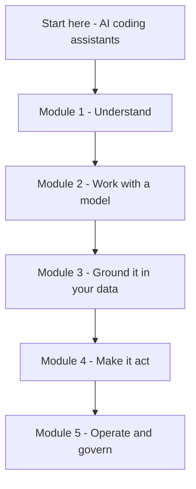

**Stage 0** is the foundation layer. The goal here is breadth, not depth: understand what
each concept *is* and *when* to use it. We go from foundation to advanced, and deeper
explanations come in later stages.

Written for **technical builders** — developers, AI/data engineers, DevSecOps, platform and
solution architects — who want to *use and apply* AI, not train models. Light on ML/DL
internals, heavy on what you need to build confidently.

## How to work through this

Follow the five modules in order — each builds on the last, from *understanding* models to
*operating* them in production. New here? Start with
**[AI coding assistants]()** — the tools you
already use — then Module 1.

### Module 1 · Understand

*Goal: know what these models are and how they behave.*

1. [The AI landscape]()
2. [Foundation models]()
3. [Generative AI]()
4. [Multimodality]()
5. [How LLMs work]()
6. [Under the hood]()
7. [How models are trained]()
8. [Limitations & failure modes]()

### Module 2 · Work with a model

*Goal: talk to a model and control its output.*

1. [Choosing a model]()
2. [Reasoning models]()
3. [The AI API]()
4. [Inference parameters]()
5. [Structured outputs]()
6. [Cost & tokens]()
7. [Prompt engineering]()
8. [Context engineering]()

### Module 3 · Ground it in your data

*Goal: make answers use your own, current data.*

1. [Embeddings]()
2. [RAG]()

### Module 4 · Make it act

*Goal: let the model use tools and run as an agent.*

1. [Tool & function calling]()
2. [Agentic AI]()
3. [Agents]()
4. [MCP]()

### Module 5 · Operate & govern

*Goal: ship it safely, measurably, and responsibly.*

1. [Guardrails]()
2. [AI security]()
3. [Model evaluation]()
4. [Observability]()
5. [Responsible AI]()
