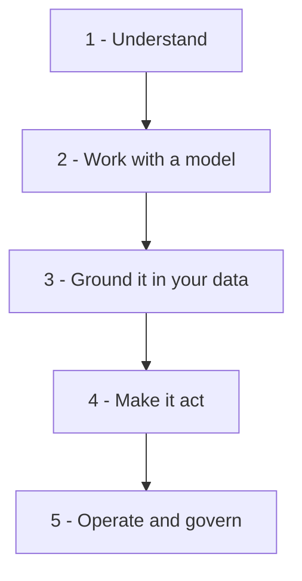

**Stage 0** is the foundation layer. The goal here is breadth, not depth: understand what
each concept *is* and *when* to use it, then go deeper in later stages.

Written for **technical builders** — developers, AI/data engineers, DevSecOps, platform and
solution architects — who want to *use and apply* AI, not train models. Light on ML/DL
internals, heavy on what you need to build confidently.

## The five modules

Work through them in order — each builds on the last. Start at
**[The AI landscape]()** and follow the sidebar; every module
lists its pages in reading order.

```mermaid
flowchart TB
    M1[1 - Understand] --> M2[2 - Work with a model]
    M2 --> M3[3 - Ground it in your data]
    M3 --> M4[4 - Make it act]
    M4 --> M5[5 - Operate and govern]
```

1. **[Understand]()** — what these models are and how they behave.
2. **[Work with a model]()** — call a model and control its output.
3. **[Ground it in your data]()** — make answers use your own, current data.
4. **[Make it act]()** — tools, agents, agentic AI, and MCP.
5. **[Operate & govern]()** — guardrails, security, evaluation, observability, responsible AI.
