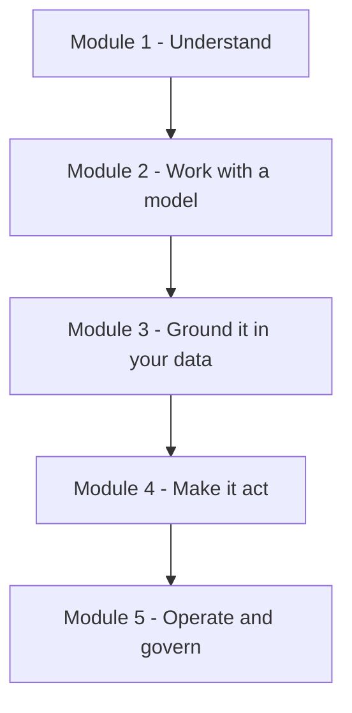

**Stage 0** is the foundation layer. The goal here is breadth, not depth: understand what
each concept *is* and *when* to use it. We go from foundation to advanced, and deeper
explanations come in later stages.

Written for **technical builders** — developers, AI/data engineers, DevSecOps, platform and
solution architects — who want to *use and apply* AI, not train models. Light on ML/DL
internals, heavy on what you need to build confidently.

## How to work through this

Follow the five modules in order — each builds on the last, from *understanding* models to
*operating* them in production. Start at
**[The AI landscape]()** and read each module top
to bottom.

```mermaid
flowchart TB
    M1[Module 1 - Understand] --> M2[Module 2 - Work with a model]
    M2 --> M3[Module 3 - Ground it in your data]
    M3 --> M4[Module 4 - Make it act]
    M4 --> M5[Module 5 - Operate and govern]
```

### Module 1 · Understand

*Goal: know what these models are and how they behave.*

1. [The AI landscape]()
2. [Generative AI]()
3. [Foundation models]()
4. [How LLMs work]()
5. [Under the hood]()
6. [How models are trained]()
7. [Multimodality]()
8. [Limitations & failure modes]()

### Module 2 · Work with a model

*Goal: talk to a model and control its output.*

1. [The AI API]()
2. [Inference parameters]()
3. [Prompt engineering]()
4. [Context engineering]()
5. [Structured outputs]()
6. [Reasoning models]()
7. [Cost & tokens]()
8. [Choosing a model]() — *the capstone: pick
   the right model once you know the knobs and the costs*

### Module 3 · Ground it in your data

*Goal: make answers use your own, current data.*

1. [Embeddings]()
2. [RAG]()

### Module 4 · Make it act

*Goal: let the model use tools and run as an agent.*

1. [Tool & function calling]()
2. [Agents]()
3. [Agentic AI]()
4. [MCP]()
5. [AI coding assistants]() — *a complete
   agent you already use every day*

### Module 5 · Operate & govern

*Goal: ship it safely, measurably, and responsibly.*

1. [Guardrails]()
2. [AI security]()
3. [Model evaluation]()
4. [Observability]()
5. [Responsible AI]()
