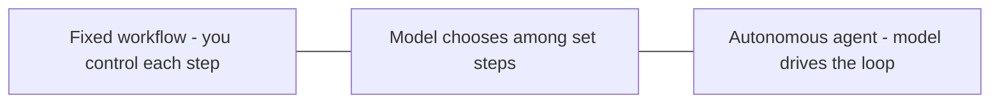
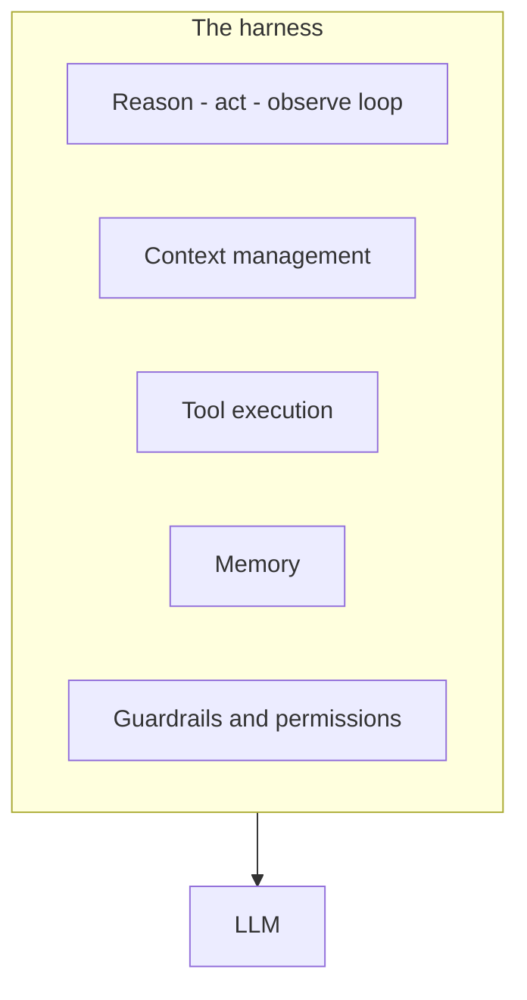

**Agentic** describes systems where the model doesn't just answer — it drives its own
multi-step actions toward a goal, deciding what to do next and using tools along the way.

## Workflows vs. agents

It's a spectrum of how much control you hand to the model:

- **Workflow** — you code the steps; the model fills in blanks (extract, classify, summarize).
  Predictable and cheap.
- **Agent** — the model decides the steps at runtime via a
  [reason → act → observe loop](). Flexible but harder to
  predict.

Prefer the leftmost option that solves the problem. Agentic is powerful, not free.

## The harness

An agent is a model **plus a harness** — the scaffolding around it that makes the loop work:

The model is the engine; the harness is the chassis — it runs the loop, manages the
[context window](), executes
[tool calls](), stores memory, and enforces
[guardrails]().

## When to go agentic

- ✅ The task is multi-step and hard to fully script in advance.
- ✅ It needs to react to intermediate results (search, then decide, then act).
- ❌ A fixed workflow already solves it — don't add autonomy you don't need.

## The trade-off

More autonomy = more capability, but also more cost, more latency, and less predictability.
That's why [evaluation]() and
[guardrails]() matter more the more agentic you go.
