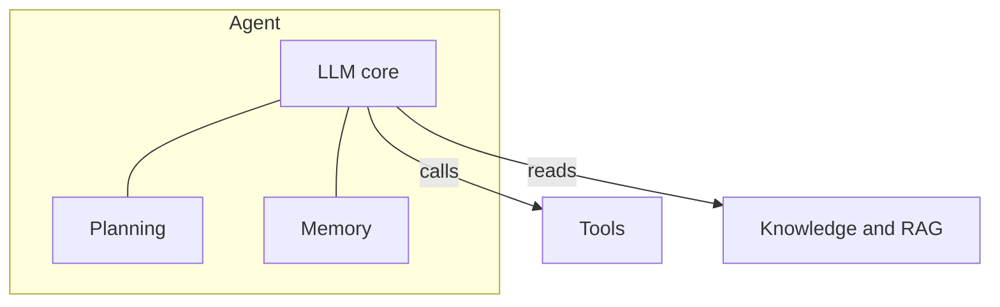
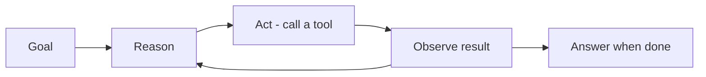

## What it is

An **agent** is a foundation model that can plan and take actions to reach a goal, rather
than just returning a single response. It decides what to do, calls **tools** (search, APIs,
code, databases), observes the result, and repeats until the task is done.

## Core components

- **Planning** — break a goal into steps and decide what to do next.
- **Tool use** — call external functions/APIs to act or fetch data.
- **Memory** — keep track of context across steps (short-term and long-term).
- **Reflection** — evaluate results and adjust the approach.

## Chat vs. agent

- A plain **chat** call: one prompt in, one answer out.
- An **agent**: a loop of *think → act → observe* that can use tools and take multiple steps.

## When to use

- The task needs several steps or external actions (not just text generation).
- The model must fetch fresh data or operate on systems (search, code, APIs).
- Outcomes depend on intermediate results the model can't know in advance.

> More autonomy means more capability — and more need for **guardrails** and oversight.
