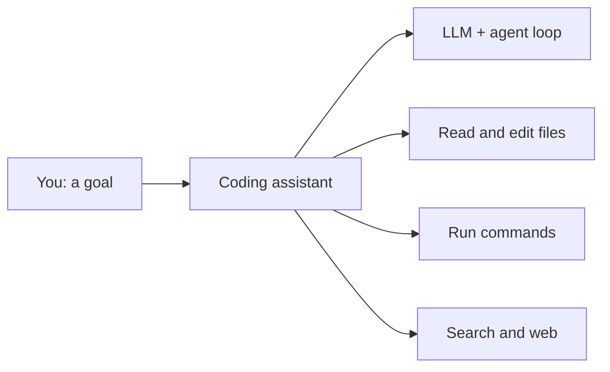

Odds are you already use one of these. This page is the **on-ramp**: what these tools
actually are, so the rest of the vault clicks into place.

## What they are

An AI coding assistant is an [agent]() for software
work: an LLM wrapped in a **harness** that can read and edit your files, run commands, search,
and use tools — in your editor or terminal.

## The landscape (moves fast)

- **Terminal / CLI agents** — Claude Code, OpenAI Codex CLI, Gemini CLI.
- **Editor / IDE agents** — Cursor, GitHub Copilot, Google Antigravity.
- **Cloud / async agents** — run tasks on a server and open a pull request.

They differ in surface and model, but the shape is the same: **model + harness + tools**.

## What's under the hood

Every one of them is built from the concepts in this stage:

- A [foundation model]() does the reasoning.
- A [harness / agent loop]() runs *reason → act →
  observe*.
- [Tool & function calling]() lets it edit
  files and run commands.
- [Context engineering]() decides what code
  and history the model sees.
- [MCP]() connects it to external tools and data.

## Why this matters for your path

Understanding these pieces makes you **better at using** the tools (clearer goals, better
context, knowing when they'll struggle) — and it's the same knowledge you'll use to **build
your own** agents and AI apps in [Stage 2](). Using is the on-ramp;
building is the destination.
