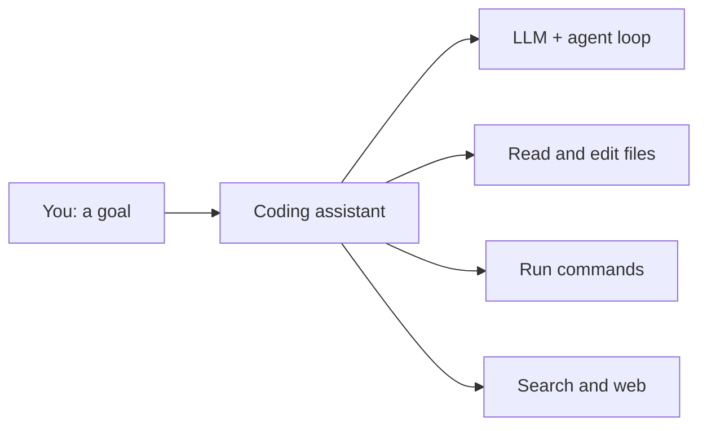

## Goal

See this module's concepts running as one product. An AI coding assistant is the most
complete agent most builders touch daily — understanding what's inside makes you better at
*using* it, and it's the same architecture you'll *build* in
[Stage 2]().

## What they are

An AI coding assistant is an [agent]() for software work:
an LLM wrapped in a **harness** that can read and edit your files, run commands, search, and
use tools — in your editor, terminal, or as a cloud agent that opens a pull request. Products
differ (Claude Code, Codex, Cursor, Copilot, Gemini CLI…), but the shape is always the same:
**model + harness + tools**.

```mermaid
flowchart LR
    You[You: a goal] --> A[Coding assistant]
    A --> M[LLM + agent loop]
    A --> F[Read and edit files]
    A --> C[Run commands]
    A --> W[Search and web]
```

## What's under the hood

Every one of them is built from the concepts in this stage:

- A [foundation model]() does the reasoning.
- The [agent loop]() runs *reason → act → observe*.
- [Tool & function calling]() lets it edit
  files and run commands.
- [Context engineering]() decides what code
  and history the model sees.
- [MCP]() connects it to external tools and data.

## Example — one task through the loop

You say: *"the login test is failing — fix it."*

1. **Act** — runs the test suite; **observe** — one assertion fails on an expired mock token.
2. **Act** — reads the test and the auth module; **observe** — the token helper hardcodes a
   date.
3. **Act** — edits the helper to generate a fresh date, re-runs the tests; **observe** — green.
4. **Answer** — summarizes the change and shows the diff.

No step was scripted — the model chose each action from what it observed. That's the
[agent loop](), applied to code.

## Strengths & limitations

- **Strengths** — tireless on mechanical, multi-file work; verifies its own changes by
  running tests and commands; one clear goal plus good context routinely beats hand-typing
  the change.
- **Limitations** — quality tracks *your* input: vague goals or missing context produce
  confident wrong changes; struggles with implicit knowledge that lives only in your head or
  your team; long sessions degrade as context fills. You review the diff — it ships nothing
  on its own.

## Sources

- [Anthropic — Building effective agents](https://www.anthropic.com/research/building-effective-agents)
- [Anthropic — Agent SDK overview](https://platform.claude.com/docs/en/agent-sdk/overview)
